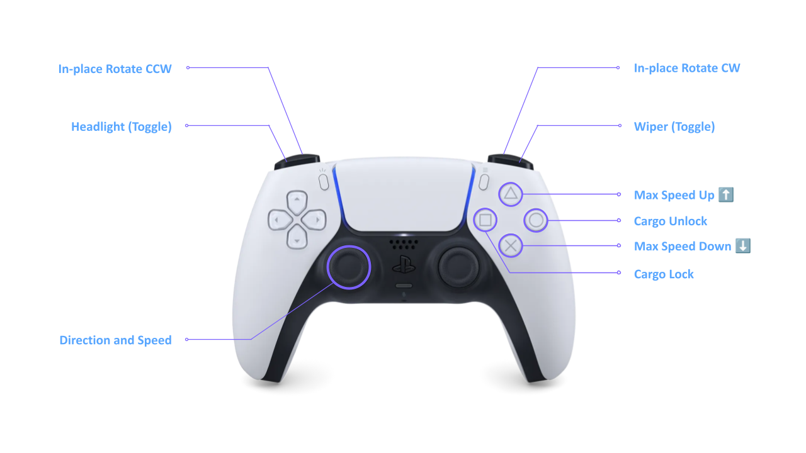

<a id="readme-top"></a>

<div align="right">

🌐 **English** · [Korean](README_ko.md)

</div>

<!-- BANNER -->
<div align="center">
  
</div>

<br />

<!-- PROJECT SHIELDS -->
<div align="center">

[](https://docs.ros.org/en/humble/)
[](https://isocpp.org/)
[](https://www.python.org/)
[](https://releases.ubuntu.com/22.04/)
[](https://www.nvidia.com/en-us/autonomous-machines/embedded-systems/jetson-orin/)

[](https://github.com/ROBOTIS-move/antbot/stargazers)
[](https://github.com/ROBOTIS-move/antbot/network/members)
[](https://github.com/ROBOTIS-move/antbot/issues)
[](https://github.com/ROBOTIS-move/antbot/commits)
[](https://github.com/ROBOTIS-move/antbot)

</div>

<br />

<!-- TAGLINE -->
<div align="center">
  <p>
    <strong>4-Wheel Independent Swerve-Drive Platform</strong> by <a href="https://www.robotis.com/">ROBOTIS AI</a>
    <br />
    <br />
    <a href="#-getting-started"><strong>Get Started »</strong></a>
    &ensp;·&ensp;
    <a href="#-packages"><strong>Packages »</strong></a>
    &ensp;·&ensp;
    <a href="#-architecture"><strong>Architecture »</strong></a>
  </p>
</div>

<br />

---

<!-- TABLE OF CONTENTS -->
<details open>
  <summary><h2>📌 Table of Contents</h2></summary>
  <ol>
    <li><a href="#-about">About</a></li>
    <li><a href="#-packages">Packages</a></li>
    <li><a href="#-architecture">Architecture</a></li>
    <li><a href="#-directory-structure">Directory Structure</a></li>
    <li>
      <a href="#-getting-started">Getting Started</a>
      <ul>
        <li><a href="#prerequisites">Prerequisites</a></li>
        <li><a href="#installation">Installation</a></li>
      </ul>
    </li>
    <li>
      <a href="#-usage">Usage</a>
      <ul>
        <li><a href="#full-robot-bringup">Full Robot Bringup</a></li>
        <li><a href="#visualization">Visualization</a></li>
        <li><a href="#teleoperation">Teleoperation</a></li>
        <li><a href="#manual-velocity-commands">Manual Velocity Commands</a></li>
      </ul>
    </li>
    <li><a href="#-hardware-specifications">Hardware Specifications</a></li>
    <li><a href="#-ros-2-topics--interfaces">ROS 2 Topics & Interfaces</a></li>
    <li><a href="#-license">License</a></li>
    <li><a href="#-contact">Contact</a></li>
    <li><a href="#-contributors">Contributors</a></li>
  </ol>
</details>

---

<!-- ABOUT -->
## 🤖 About

**AntBot** is a production-ready, open-source ROS 2 robot stack designed for the ROBOTIS AI AntBot autonomous delivery robot — a **4-wheel independent swerve-drive platform** built for last-mile delivery.

<div align="center">


</div>

This repository provides a complete, modular software stack to operate the robot:

- 🛞 **Swerve-drive controller** with inverse kinematics, motion profiling, and odometry
- 🔌 **Hardware interface** for the ANT-RCU board via Dynamixel Protocol 2.0
- 📷 **Multi-camera driver** supporting V4L2, USB, and Orbbec Gemini 336L RGB-D
- 📡 **Sensor integration** for 2D/3D LiDAR, IMU, and GNSS
- 🤖 **Complete URDF model** with sensor frames and visual meshes
- 🚀 **One-command bringup** to launch the entire robot system

Built entirely on [ROS 2 Humble](https://docs.ros.org/en/humble/) and the [ros2_control](https://control.ros.org/) framework.

<p align="right">(<a href="#readme-top">back to top</a>)</p>

---

<!-- PACKAGES -->
## 📦 Packages

| Package | Description |
|:--------|:------------|
| [`antbot`](antbot/) | Meta-package for the AntBot project |
| [`antbot_bringup`](antbot_bringup/) | Launch files for all hardware drivers, controllers, and sensors |
| [`antbot_description`](antbot_description/) | URDF / Xacro robot model with sensor frames and meshes |
| [`antbot_swerve_controller`](antbot_swerve_controller/) | ros2_control swerve-drive controller with IK, motion profiling, and odometry |
| [`antbot_hw_interface`](antbot_hw_interface/) | ros2_control `SystemInterface` plugin for the RCU board |
| [`antbot_libs`](antbot_libs/) | Shared C++ library for Dynamixel Protocol 2.0 communication |
| [`antbot_interfaces`](antbot_interfaces/) | Custom ROS 2 message and service definitions |
| [`antbot_camera`](antbot_camera/) | Multi-driver camera package (V4L2 / USB / Orbbec Gemini 336L RGB-D) |
| [`antbot_imu`](antbot_imu/) | IMU driver with complementary filter and auto-calibration |
| [`antbot_teleop`](antbot_teleop/) | Keyboard/joystick teleoperation with holonomic velocity control |

> **External sensor drivers** included: [`vanjee_lidar_sdk`](vanjee_lidar_sdk/) (3D LiDAR) and [`vanjee_lidar_msg`](vanjee_lidar_msg/) (LiDAR message definitions).

<p align="right">(<a href="#readme-top">back to top</a>)</p>

---

<!-- ARCHITECTURE -->
## 🏛️ Architecture

<details>
<summary><strong>System Block Diagram</strong> (click to expand)</summary>
<br />

```
  antbot_bringup                    antbot_description
  (launch files)                    (URDF / Xacro, meshes)
       │                                   │
       │  launches                         │  robot_description
       ▼                                   ▼
┌──────────────────────────────────────────────────────┐
│               ros2_control Framework                 │
│             (Controller Manager)                     │
│                                                      │
│   antbot_swerve_controller  ◄──── /cmd_vel           │
│   (IK, motion profiling, odometry)                   │
│             ├── /odom                                │
│             └── /tf                                  │
└───────────────────────┬──────────────────────────────┘
                 read() │ write()
                        ▼
          ┌───────────────────────────────┐
          │   antbot_hw_interface         │
          │   (BoardInterface plugin)     │
          │                               │
          │   Wheel ─ Steering            │
          │   Encoder ─ Motor             │
          │   Battery ─ Ultrasound        │
          │   Cargo ─ Headlight ─ Wiper   │
          └──────────────┬────────────────┘
                         │
          ┌──────────────▼────────────────┐
          │   antbot_libs                 │      ┌─────────────────────┐
          │   Communicator                │      │   antbot_imu        │
          │   ControlTableParser          │      │   (ImuNode)         │
          └──────────────┬────────────────┘      └──────────┬──────────┘
                         │                                  │
          ┌──────────────▼──────────────────────────────────▼───┐
          │            Serial (Dynamixel Protocol 2.0)          │
          └──────────────┬──────────────────────────────────┬───┘
                         │                                  │
                  ┌──────▼──────┐                    ┌──────▼──────┐
                  │  ANT-RCU    │                    │  IMU Board  │
                  │  Motors x4  │                    │  Accel/Gyro │
                  │  Steering x4│                    └─────────────┘
                  │  Encoders   │
                  │  Battery    │
                  └─────────────┘

          ┌───────────────────────────────┐
          │   antbot_camera               │
          │   V4L2 / USB / Gemini 336L    │──── /sensor/camera/*/image_raw
          └───────────────────────────────┘

          ┌───────────────────────────────┐
          │   vanjee_lidar_sdk            │
          │   Vanjee WLR-722 (3D)         │──── /sensor/lidar_3d/point_cloud
          │   COIN D4 (2D) × 2            │──── /sensor/lidar_2d_{front,back}/scan
          └───────────────────────────────┘
```

</details>

### Launch Dependency Graph

```
bringup.launch.py
 ├── robot_state_publisher.launch.py    →  URDF → /tf, /tf_static
 ├── controller.launch.py              →  ros2_control + swerve controller
 ├── imu.launch.py                     →  6-axis IMU
 ├── lidar_2d.launch.py                →  2× COIN D4 (USB serial)
 ├── lidar_3d.launch.py                →  Vanjee WLR-722 (Ethernet)
 ├── ublox_gps_node-launch.py          →  u-blox GNSS
 ├── camera.launch.py                  →  V4L2 + USB + RGB-D cameras
 └── teleop_joy.launch.py             →  DualSense joystick teleop
```

<p align="right">(<a href="#readme-top">back to top</a>)</p>

---

<!-- DIRECTORY STRUCTURE -->
## 📂 Directory Structure

```
antbot/
├── antbot/                        # Meta-package
├── antbot_bringup/                # Launch files (bringup, view, controller, sensors)
├── antbot_description/            # URDF / Xacro model, meshes, RViz config
├── antbot_swerve_controller/      # Swerve-drive controller (IK, odometry, profiling)
├── antbot_hw_interface/           # ros2_control hardware plugin for ANT-RCU
├── antbot_libs/                   # Shared C++ library (Dynamixel comms, XML parsing)
├── antbot_interfaces/             # Custom ROS 2 message and service definitions
├── antbot_camera/                 # Multi-driver camera node (V4L2, USB, RGB-D)
├── antbot_imu/                    # IMU driver with complementary filter
├── antbot_teleop/                 # Keyboard/joystick teleoperation (Python)
├── vanjee_lidar_sdk/              # Vanjee 3D LiDAR driver
├── vanjee_lidar_msg/              # Vanjee LiDAR message definitions
├── docs/                          # Documentation and images
├── setting.sh                     # Dependency installation script
└── additional_repos.repos         # External repository list for vcs import
```

<p align="right">(<a href="#readme-top">back to top</a>)</p>

---

<!-- GETTING STARTED -->
## 🚀 Getting Started

> **Quick Start** — Already have ROS 2 Humble installed?
> ```bash
> mkdir -p ~/antbot_ws/src && cd ~/antbot_ws/src
> git clone https://github.com/ROBOTIS-move/antbot.git
> cd ~/antbot_ws/src/antbot && bash setting.sh
> cd ~/antbot_ws && colcon build --symlink-install && source install/setup.bash
> ros2 launch antbot_bringup bringup.launch.py
> ```

### Prerequisites

- [](https://releases.ubuntu.com/22.04/)
- [](https://docs.ros.org/en/humble/Installation.html)
- [](https://isocpp.org/)

### Installation

**1.** Create a workspace and clone the repository:

```bash
mkdir -p ~/antbot_ws/src && cd ~/antbot_ws/src
git clone https://github.com/ROBOTIS-move/antbot.git
```

**2.** Run the setup script to install dependencies (system tools, external repos, and ROS dependencies via `rosdep`):

```bash
cd ~/antbot_ws/src/antbot
bash setting.sh
```

**3.** Build the workspace:

```bash
cd ~/antbot_ws
colcon build --symlink-install
```

**4.** Source the workspace:

```bash
source ~/antbot_ws/install/setup.bash
```

> 💡 **Tip**: Add `source ~/antbot_ws/install/setup.bash` to your `~/.bashrc` for automatic sourcing on every new terminal.

<p align="right">(<a href="#readme-top">back to top</a>)</p>

---

<!-- USAGE -->
## 🎮 Usage

### Full Robot Bringup

Launch the complete system — ros2_control, swerve controller, IMU, LiDAR, GPS, and cameras:

```bash
ros2 launch antbot_bringup bringup.launch.py
```

### Visualization

**Monitor all sensors with RViz** (run on a separate PC):

```bash
ros2 launch antbot_bringup view.launch.py
```

**Preview the URDF model** (no hardware required):

```bash
ros2 launch antbot_description description.launch.py
```

### Teleoperation

Drive the robot with your keyboard/joystick:

```bash
# Keyboard teleop (run in terminal)
ros2 run antbot_teleop teleop_keyboard

# Joystick teleop (DualSense, USB)
ros2 launch antbot_teleop teleop_joy.launch.py
```

**Key bindings:**

| Key       | Action              |
|:---------:|---------------------|
| `W` / `X` | Forward / Backward  |
| `A` / `D` | Strafe Left / Right |
| `Q` / `E` | Rotate CCW / CW     |
| `S`       | Stop                |
| `1` ~ `9` | Speed Level         |
| `ESC`     | Quit                |

**Joystick button bindings** (DualSense):



### Manual Velocity Commands

```bash
# Drive forward at 0.5 m/s
ros2 topic pub /cmd_vel geometry_msgs/msg/Twist \
  "{linear: {x: 0.5, y: 0.0, z: 0.0}, angular: {x: 0.0, y: 0.0, z: 0.0}}"

# Strafe right at 0.3 m/s
ros2 topic pub /cmd_vel geometry_msgs/msg/Twist \
  "{linear: {x: 0.0, y: -0.3, z: 0.0}, angular: {x: 0.0, y: 0.0, z: 0.0}}"

# Rotate in place at 1.0 rad/s
ros2 topic pub /cmd_vel geometry_msgs/msg/Twist \
  "{linear: {x: 0.0, y: 0.0, z: 0.0}, angular: {x: 0.0, y: 0.0, z: 1.0}}"
```

<p align="right">(<a href="#readme-top">back to top</a>)</p>

---

<!-- HARDWARE -->
## 🔧 Hardware Specifications

<table>
  <tr>
    <th align="left" width="180">Component</th>
    <th align="left">Specification</th>
  </tr>
  <tr>
    <td><strong>Drive Type</strong></td>
    <td>4-wheel independent swerve drive</td>
  </tr>
  <tr>
    <td><strong>Control Board</strong></td>
    <td>ANT-RCU (Dynamixel Protocol 2.0, ID 200)</td>
  </tr>
  <tr>
    <td><strong>Communication</strong></td>
    <td>USB Serial @ 4 Mbps</td>
  </tr>
  <tr>
    <td><strong>Wheel Motors</strong></td>
    <td>4× (M1–M4), range: −185 ~ 185 RPM</td>
  </tr>
  <tr>
    <td><strong>Steering Motors</strong></td>
    <td>4× (S1–S4), range: −56.2° ~ 56.2°</td>
  </tr>
  <tr>
    <td><strong>Cameras</strong></td>
    <td>1× Stereo RGB-D (Orbbec Gemini 336L) + 4× Mono (Novitec V4L2)</td>
  </tr>
  <tr>
    <td><strong>3D LiDAR</strong></td>
    <td>Vanjee WLR-722 (Ethernet)</td>
  </tr>
  <tr>
    <td><strong>2D LiDAR</strong></td>
    <td>2× COIN D4 (USB Serial)</td>
  </tr>
  <tr>
    <td><strong>IMU</strong></td>
    <td>6-axis (3-axis accelerometer + 3-axis gyroscope)</td>
  </tr>
  <tr>
    <td><strong>GNSS</strong></td>
    <td>u-blox GPS receiver</td>
  </tr>
  <tr>
    <td><strong>Battery</strong></td>
    <td>BMS monitored (voltage, current, SoC, temperature)</td>
  </tr>
</table>

<p align="right">(<a href="#readme-top">back to top</a>)</p>

---

<!-- TOPICS -->
## 📡 ROS 2 Topics & Interfaces

### Published Topics

| Topic | Type | Description |
|:------|:-----|:------------|
| `/odom` | [](https://docs.ros2.org/latest/api/nav_msgs/msg/Odometry.html) | Robot odometry from swerve controller |
| `/tf` | [](https://docs.ros2.org/latest/api/tf2_msgs/msg/TFMessage.html) | Transform tree |
| `/imu_node/imu/accel_gyro` | [](https://docs.ros2.org/latest/api/sensor_msgs/msg/Imu.html) | IMU data (quaternion, angular velocity, linear acceleration) |
| `/sensor/camera/*/image_raw` | [](https://docs.ros2.org/latest/api/sensor_msgs/msg/Image.html) | Camera image streams |
| `/sensor/camera/*/camera_info` | [](https://docs.ros2.org/latest/api/sensor_msgs/msg/CameraInfo.html) | Camera calibration data |
| `/sensor/lidar_3d/point_cloud` | [](https://docs.ros2.org/latest/api/sensor_msgs/msg/PointCloud2.html) | 3D point cloud |
| `/sensor/lidar_2d_front/scan` | [](https://docs.ros2.org/latest/api/sensor_msgs/msg/LaserScan.html) | Front 2D laser scan |
| `/sensor/lidar_2d_back/scan` | [](https://docs.ros2.org/latest/api/sensor_msgs/msg/LaserScan.html) | Rear 2D laser scan |

### Subscribed Topics

| Topic | Type | Description |
|:------|:-----|:------------|
| `/cmd_vel` | [](https://docs.ros2.org/latest/api/geometry_msgs/msg/Twist.html) | Velocity commands (linear x/y + angular z) |

### Services

| Service | Type | Description |
|:--------|:-----|:------------|
| `/cargo/command` | [](antbot_interfaces/) | Lock / unlock the cargo door |
| `/headlight/operation` | [](https://docs.ros2.org/latest/api/std_srvs/srv/SetBool.html) | Turn headlight on / off |
| `/wiper/operation` | [](antbot_interfaces/) | Set wiper mode (OFF / ONCE / REPEAT) |

### Key Dependencies

| Package | Purpose |
|:--------|:--------|
| [](https://github.com/ROBOTIS-GIT/DynamixelSDK) | Dynamixel Protocol 2.0 communication |
| [](https://github.com/ros-controls/ros2_control) | Controller manager framework |
| [](https://github.com/PickNikRobotics/generate_parameter_library) | Declarative parameter generation |
| [](https://github.com/ros-perception/vision_opencv) | ROS ↔ OpenCV image conversion |
| [](https://github.com/leethomason/tinyxml2) | Control table XML parsing |
| [](https://github.com/CCNYRoboticsLab/imu_tools) | IMU visualization in RViz |

<p align="right">(<a href="#readme-top">back to top</a>)</p>

---

<!-- LICENSE -->
## 📄 License

Distributed under the **Apache License 2.0**. See [`LICENSE`](https://www.apache.org/licenses/LICENSE-2.0) for more information.

```
Copyright 2026 ROBOTIS AI CO., LTD.
```

<p align="right">(<a href="#readme-top">back to top</a>)</p>

---

<!-- CONTRIBUTORS -->
## 👥 Contributors

<a href="https://github.com/ROBOTIS-move/antbot/graphs/contributors">
  
</a>

<p align="right">(<a href="#readme-top">back to top</a>)</p>

---

<!-- CONTACT -->
## 📬 Contact

**ROBOTIS AI CO., LTD.**

- 🌐 Website: [www.robotis.com](https://www.robotis.com/)

<p align="right">(<a href="#readme-top">back to top</a>)</p>

---

<div align="center">
  
  <br />
  <sub>Made with 💚 by <a href="https://www.robotis.com/">ROBOTIS AI</a></sub>
</div>
