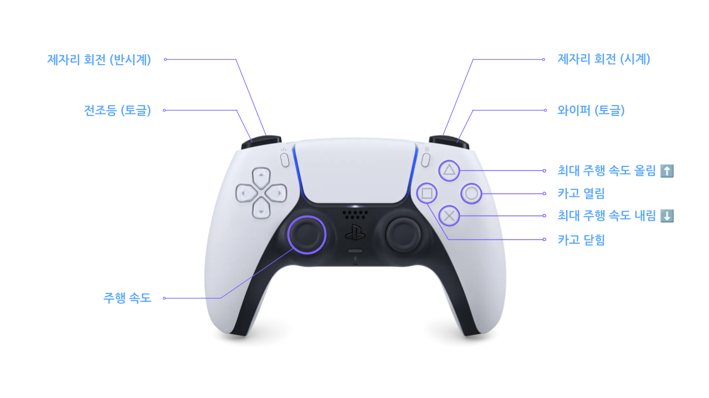

<a id="readme-top"></a>

<div align="right">

🌐 [English](README.md) · **한국어**

</div>

<!-- BANNER -->
<div align="center">
  
</div>

<br />

<!-- PROJECT SHIELDS -->
<div align="center">

[](https://docs.ros.org/en/humble/)
[](https://isocpp.org/)
[](https://www.python.org/)
[](https://releases.ubuntu.com/22.04/)
[](https://www.nvidia.com/en-us/autonomous-machines/embedded-systems/jetson-orin/)

[](https://github.com/ROBOTIS-move/antbot/stargazers)
[](https://github.com/ROBOTIS-move/antbot/network/members)
[](https://github.com/ROBOTIS-move/antbot/issues)
[](https://github.com/ROBOTIS-move/antbot/commits)
[](https://github.com/ROBOTIS-move/antbot)

</div>

<br />

<!-- TAGLINE -->
<div align="center">
  <p>
    <strong>4WD 독립 조향 스워브 드라이브 로봇</strong> by <a href="https://www.robotis.com/">ROBOTIS AI</a>
    <br />
    <br />
    <a href="#-시작하기"><strong>시작하기 »</strong></a>
    &ensp;·&ensp;
    <a href="#-패키지"><strong>패키지 »</strong></a>
    &ensp;·&ensp;
    <a href="#️-아키텍처"><strong>아키텍처 »</strong></a>
  </p>
</div>

<br />

---

<!-- TABLE OF CONTENTS -->
<details open>
  <summary><h2>📌 목차</h2></summary>
  <ol>
    <li><a href="#-소개">소개</a></li>
    <li><a href="#-패키지">패키지</a></li>
    <li><a href="#️-아키텍처">아키텍처</a></li>
    <li><a href="#-디렉토리-구조">디렉토리 구조</a></li>
    <li>
      <a href="#-시작하기">시작하기</a>
      <ul>
        <li><a href="#사전-요구사항">사전 요구사항</a></li>
        <li><a href="#설치">설치</a></li>
      </ul>
    </li>
    <li>
      <a href="#-사용법">사용법</a>
      <ul>
        <li><a href="#전체-로봇-bringup">전체 로봇 Bringup</a></li>
        <li><a href="#시각화">시각화</a></li>
        <li><a href="#원격-조종">원격 조종</a></li>
        <li><a href="#수동-속도-명령">수동 속도 명령</a></li>
      </ul>
    </li>
    <li><a href="#-하드웨어-사양">하드웨어 사양</a></li>
    <li><a href="#-ros-2-토픽--인터페이스">ROS 2 토픽 & 인터페이스</a></li>
    <li><a href="#-라이선스">라이선스</a></li>
    <li><a href="#-연락처">연락처</a></li>
    <li><a href="#-contributors">Contributors</a></li>
  </ol>
</details>

---

<!-- ABOUT -->
## 🤖 소개

**AntBot**은 ROBOTIS AI에서 개발한 자율 배송 로봇용 오픈소스 ROS 2 소프트웨어입니다. 4바퀴가 각각 독립적으로 조향하는 **스워브 드라이브 방식**으로, 실제 배송 현장에서 바로 사용할 수 있는 수준의 코드를 제공합니다.

<div align="center">


</div>

이 저장소 하나로 로봇 구동에 필요한 모든 것을 갖출 수 있습니다:

- 🛞 **Swerve-drive controller** — 역기구학 기반 4륜 독립 조향 제어, 오도메트리 출력
- 🔌 **Hardware interface** — Dynamixel Protocol 2.0으로 ANT-RCU 보드와 통신
- 📷 **Multi-camera driver** — V4L2, USB, Orbbec Gemini 336L RGB-D 카메라 동시 지원
- 📡 **Sensor integration** — 2D/3D LiDAR, IMU, GNSS 센서 통합 관리
- 🤖 **Complete URDF model** — 센서 프레임, 메시까지 포함된 전체 로봇 모델
- 🚀 **One-command bringup** — 명령어 하나로 전체 시스템 한 번에 실행

[ROS 2 Humble](https://docs.ros.org/en/humble/) + [ros2_control](https://control.ros.org/) 기반입니다.

<p align="right">(<a href="#readme-top">상단으로</a>)</p>

---

<!-- PACKAGES -->
## 📦 패키지

| Package | 설명 |
|:--------|:----|
| [`antbot`](antbot/) | 메타 패키지 |
| [`antbot_bringup`](antbot_bringup/) | 전체 시스템 launch 파일 모음 |
| [`antbot_description`](antbot_description/) | URDF / Xacro 로봇 모델 (센서 프레임, 메시 포함) |
| [`antbot_swerve_controller`](antbot_swerve_controller/) | ros2_control 기반 스워브 드라이브 컨트롤러 (IK, 오도메트리) |
| [`antbot_hw_interface`](antbot_hw_interface/) | RCU 보드용 ros2_control `SystemInterface` 플러그인 |
| [`antbot_libs`](antbot_libs/) | Dynamixel Protocol 2.0 통신 라이브러리 (C++) |
| [`antbot_interfaces`](antbot_interfaces/) | 커스텀 ROS 2 메시지 및 서비스 정의 |
| [`antbot_camera`](antbot_camera/) | 멀티 카메라 드라이버 (V4L2 / USB / Orbbec RGB-D) |
| [`antbot_imu`](antbot_imu/) | IMU 드라이버 (상보 필터, 자동 캘리브레이션) |
| [`antbot_teleop`](antbot_teleop/) | 키보드 원격 조종 (전방향 이동 지원) |

> **외부 센서 드라이버** 포함: [`vanjee_lidar_sdk`](vanjee_lidar_sdk/) (3D LiDAR), [`vanjee_lidar_msg`](vanjee_lidar_msg/) (LiDAR 메시지 정의)

<p align="right">(<a href="#readme-top">상단으로</a>)</p>

---

<!-- ARCHITECTURE -->
## 🏛️ 아키텍처

<details>
<summary><strong>System Block Diagram</strong> (클릭하여 펼치기)</summary>
<br />

```
  antbot_bringup                    antbot_description
  (launch files)                    (URDF / Xacro, meshes)
       │                                   │
       │  launches                         │  robot_description
       ▼                                   ▼
┌──────────────────────────────────────────────────────┐
│               ros2_control Framework                 │
│             (Controller Manager)                     │
│                                                      │
│   antbot_swerve_controller  ◄──── /cmd_vel           │
│   (IK, motion profiling, odometry)                   │
│             ├── /odom                                │
│             └── /tf                                  │
└───────────────────────┬──────────────────────────────┘
                 read() │ write()
                        ▼
          ┌───────────────────────────────┐
          │   antbot_hw_interface         │
          │   (BoardInterface plugin)     │
          │                               │
          │   Wheel ─ Steering            │
          │   Encoder ─ Motor             │
          │   Battery                     │
          └──────────────┬────────────────┘
                         │
          ┌──────────────▼────────────────┐
          │   antbot_libs                 │      ┌─────────────────────┐
          │   Communicator                │      │   antbot_imu        │
          │   ControlTableParser          │      │   (ImuNode)         │
          └──────────────┬────────────────┘      └──────────┬──────────┘
                         │                                  │
          ┌──────────────▼──────────────────────────────────▼───┐
          │            Serial (Dynamixel Protocol 2.0)          │
          └──────────────┬──────────────────────────────────┬───┘
                         │                                  │
                  ┌──────▼──────┐                    ┌──────▼──────┐
                  │  ANT-RCU    │                    │  IMU Board  │
                  │  Motors x4  │                    │  Accel/Gyro │
                  │  Steering x4│                    └─────────────┘
                  │  Encoders   │
                  │  Battery    │
                  └─────────────┘

          ┌───────────────────────────────┐
          │   antbot_camera               │
          │   V4L2 / USB / Gemini 336L    │──── /sensor/camera/*/image_raw
          └───────────────────────────────┘

          ┌───────────────────────────────┐
          │   vanjee_lidar_sdk            │
          │   Vanjee WLR-722 (3D)         │──── /sensor/lidar_3d/point_cloud
          │   COIN D4 (2D) × 2            │──── /sensor/lidar_2d_{front,back}/scan
          └───────────────────────────────┘
```

</details>

### Launch Dependency Graph

```
bringup.launch.py
 ├── robot_state_publisher.launch.py    →  URDF → /tf, /tf_static
 ├── controller.launch.py              →  ros2_control + swerve controller
 ├── imu.launch.py                     →  6-axis IMU
 ├── lidar_2d.launch.py                →  2× COIN D4 (USB serial)
 ├── lidar_3d.launch.py                →  Vanjee WLR-722 (Ethernet)
 ├── ublox_gps_node-launch.py          →  u-blox GNSS
 ├── camera.launch.py                  →  V4L2 + USB + RGB-D cameras
 └── teleop_joy.launch.py             →  DualSense joystick teleop
```

<p align="right">(<a href="#readme-top">상단으로</a>)</p>

---

<!-- DIRECTORY STRUCTURE -->
## 📂 디렉토리 구조

```
antbot/
├── antbot/                        # 메타 패키지
├── antbot_bringup/                # Launch 파일 (bringup, view, controller, sensors)
├── antbot_description/            # URDF / Xacro 모델, 메시, RViz 설정
├── antbot_swerve_controller/      # Swerve-drive 컨트롤러 (IK, 오도메트리, 프로파일링)
├── antbot_hw_interface/           # ANT-RCU용 ros2_control 하드웨어 플러그인
├── antbot_libs/                   # 공유 C++ 라이브러리 (Dynamixel 통신, XML 파싱)
├── antbot_interfaces/             # 커스텀 ROS 2 메시지 및 서비스 정의
├── antbot_camera/                 # 멀티 드라이버 카메라 노드 (V4L2, USB, RGB-D)
├── antbot_imu/                    # 상보 필터 포함 IMU 드라이버
├── antbot_teleop/                 # 키보드 텔레오퍼레이션 (Python)
├── vanjee_lidar_sdk/              # Vanjee 3D LiDAR 드라이버
├── vanjee_lidar_msg/              # Vanjee LiDAR 메시지 정의
├── docs/                          # 문서 및 이미지
├── setting.sh                     # 의존성 설치 스크립트
└── additional_repos.repos         # vcs import용 외부 저장소 목록
```

<p align="right">(<a href="#readme-top">상단으로</a>)</p>

---

<!-- GETTING STARTED -->
## 🚀 시작하기

> **Quick Start** — ROS 2 Humble이 이미 설치되어 있다면?
> ```bash
> mkdir -p ~/antbot_ws/src && cd ~/antbot_ws/src
> git clone https://github.com/ROBOTIS-move/antbot.git
> cd ~/antbot_ws/src/antbot && bash setting.sh
> cd ~/antbot_ws && colcon build --symlink-install && source install/setup.bash
> ros2 launch antbot_bringup bringup.launch.py
> ```

### 사전 요구사항

- [](https://releases.ubuntu.com/22.04/)
- [](https://docs.ros.org/en/humble/Installation.html)
- [](https://isocpp.org/)

### 설치

**1.** 워크스페이스를 생성하고 저장소를 클론합니다:

```bash
mkdir -p ~/antbot_ws/src && cd ~/antbot_ws/src
git clone https://github.com/ROBOTIS-move/antbot.git
```

**2.** 설정 스크립트를 실행하여 의존성을 설치합니다 (시스템 도구, 외부 저장소, `rosdep` 기반 ROS 의존성):

```bash
cd ~/antbot_ws/src/antbot
bash setting.sh
```

**3.** 워크스페이스를 빌드합니다:

```bash
cd ~/antbot_ws
colcon build --symlink-install
```

**4.** 워크스페이스를 소싱합니다:

```bash
source ~/antbot_ws/install/setup.bash
```

> 💡 **Tip**: `~/.bashrc`에 `source ~/antbot_ws/install/setup.bash`를 추가하면 새 터미널마다 자동으로 소싱됩니다.

<p align="right">(<a href="#readme-top">상단으로</a>)</p>

---

<!-- USAGE -->
## 🎮 사용법

### 전체 로봇 Bringup

ros2_control, swerve controller, IMU, LiDAR, GPS, 카메라를 포함한 전체 시스템을 실행합니다:

```bash
ros2 launch antbot_bringup bringup.launch.py
```

### 시각화

**RViz로 모든 센서 모니터링** (별도 PC에서 실행):

```bash
ros2 launch antbot_bringup view.launch.py
```

**URDF 모델 미리보기** (하드웨어 불필요):

```bash
ros2 launch antbot_description description.launch.py
```

### 원격 조종

키보드로 직접 조종:

```bash
# 키보드 텔레오퍼레이션 (터미널에서 실행)
ros2 run antbot_teleop teleop_keyboard

# 조이스틱 텔레오퍼레이션 (DualSense, USB)
ros2 launch antbot_teleop teleop_joy.launch.py
```

**키 바인딩:**

| Key       | Action              |
|:---------:|---------------------|
| `W` / `X` | 전진 / 후진         |
| `A` / `D` | 좌측 / 우측 이동    |
| `Q` / `E` | 반시계 / 시계 회전  |
| `S`       | 정지                |
| `1` ~ `9` | 속도 레벨           |
| `ESC`     | 종료                |

**조이스틱 버튼 바인딩** (DualSense):



### 수동 속도 명령

```bash
# 0.5 m/s로 전진
ros2 topic pub /cmd_vel geometry_msgs/msg/Twist \
  "{linear: {x: 0.5, y: 0.0, z: 0.0}, angular: {x: 0.0, y: 0.0, z: 0.0}}"

# 0.3 m/s로 우측 이동
ros2 topic pub /cmd_vel geometry_msgs/msg/Twist \
  "{linear: {x: 0.0, y: -0.3, z: 0.0}, angular: {x: 0.0, y: 0.0, z: 0.0}}"

# 1.0 rad/s로 제자리 회전
ros2 topic pub /cmd_vel geometry_msgs/msg/Twist \
  "{linear: {x: 0.0, y: 0.0, z: 0.0}, angular: {x: 0.0, y: 0.0, z: 1.0}}"
```

<p align="right">(<a href="#readme-top">상단으로</a>)</p>

---

<!-- HARDWARE -->
## 🔧 하드웨어 사양

<table>
  <tr>
    <th align="left" width="180">구성 요소</th>
    <th align="left">사양</th>
  </tr>
  <tr>
    <td><strong>Drive Type</strong></td>
    <td>4WD 독립 조향 스워브 드라이브</td>
  </tr>
  <tr>
    <td><strong>Control Board</strong></td>
    <td>ANT-RCU (Dynamixel Protocol 2.0, ID 200)</td>
  </tr>
  <tr>
    <td><strong>Communication</strong></td>
    <td>USB Serial @ 4 Mbps</td>
  </tr>
  <tr>
    <td><strong>Wheel Motors</strong></td>
    <td>4× (M1–M4), 범위: −185 ~ 185 RPM</td>
  </tr>
  <tr>
    <td><strong>Steering Motors</strong></td>
    <td>4× (S1–S4), 범위: −56.2° ~ 56.2°</td>
  </tr>
  <tr>
    <td><strong>Cameras</strong></td>
    <td>1× 스테레오 RGB-D (Orbbec Gemini 336L) + 4× 모노 (Novitec V4L2)</td>
  </tr>
  <tr>
    <td><strong>3D LiDAR</strong></td>
    <td>Vanjee WLR-722 (Ethernet)</td>
  </tr>
  <tr>
    <td><strong>2D LiDAR</strong></td>
    <td>2× COIN D4 (USB Serial)</td>
  </tr>
  <tr>
    <td><strong>IMU</strong></td>
    <td>6축 (3축 가속도계 + 3축 자이로스코프)</td>
  </tr>
  <tr>
    <td><strong>GNSS</strong></td>
    <td>u-blox GPS 수신기</td>
  </tr>
  <tr>
    <td><strong>Battery</strong></td>
    <td>BMS 모니터링 (전압, 전류, SoC, 온도)</td>
  </tr>
</table>

<p align="right">(<a href="#readme-top">상단으로</a>)</p>

---

<!-- TOPICS -->
## 📡 ROS 2 토픽 & 인터페이스

### Published Topics

| Topic | Type | 설명 |
|:------|:-----|:----|
| `/odom` | [](https://docs.ros2.org/latest/api/nav_msgs/msg/Odometry.html) | Swerve controller 오도메트리 |
| `/tf` | [](https://docs.ros2.org/latest/api/tf2_msgs/msg/TFMessage.html) | Transform tree |
| `/imu_node/imu/accel_gyro` | [](https://docs.ros2.org/latest/api/sensor_msgs/msg/Imu.html) | IMU 데이터 (쿼터니언, 각속도, 선가속도) |
| `/sensor/camera/*/image_raw` | [](https://docs.ros2.org/latest/api/sensor_msgs/msg/Image.html) | 카메라 이미지 스트림 |
| `/sensor/camera/*/camera_info` | [](https://docs.ros2.org/latest/api/sensor_msgs/msg/CameraInfo.html) | 카메라 캘리브레이션 데이터 |
| `/sensor/lidar_3d/point_cloud` | [](https://docs.ros2.org/latest/api/sensor_msgs/msg/PointCloud2.html) | 3D 포인트 클라우드 |
| `/sensor/lidar_2d_front/scan` | [](https://docs.ros2.org/latest/api/sensor_msgs/msg/LaserScan.html) | 전방 2D 레이저 스캔 |
| `/sensor/lidar_2d_back/scan` | [](https://docs.ros2.org/latest/api/sensor_msgs/msg/LaserScan.html) | 후방 2D 레이저 스캔 |

### Subscribed Topics

| Topic | Type | 설명 |
|:------|:-----|:----|
| `/cmd_vel` | [](https://docs.ros2.org/latest/api/geometry_msgs/msg/Twist.html) | 속도 명령 (linear x/y + angular z) |

### Services

| Service | Type | 설명 |
|:--------|:-----|:----|
| `/cargo/command` | [](antbot_interfaces/) | 화물함 잠금 / 해제 |
| `/headlight/operation` | [](https://docs.ros2.org/latest/api/std_srvs/srv/SetBool.html) | 전조등 켜기 / 끄기 |
| `/wiper/operation` | [](antbot_interfaces/) | 와이퍼 모드 설정 (OFF / ONCE / REPEAT) |

### Key Dependencies

| Package | 용도 |
|:--------|:----|
| [](https://github.com/ROBOTIS-GIT/DynamixelSDK) | Dynamixel Protocol 2.0 통신 |
| [](https://github.com/ros-controls/ros2_control) | Controller manager 프레임워크 |
| [](https://github.com/PickNikRobotics/generate_parameter_library) | 파라미터 자동 생성 |
| [](https://github.com/ros-perception/vision_opencv) | ROS ↔ OpenCV 이미지 변환 |
| [](https://github.com/leethomason/tinyxml2) | Control table XML 파싱 |
| [](https://github.com/CCNYRoboticsLab/imu_tools) | RViz IMU 시각화 |

<p align="right">(<a href="#readme-top">상단으로</a>)</p>

---

<!-- LICENSE -->
## 📄 라이선스

**Apache License 2.0**하에 배포됩니다. 자세한 내용은 [`LICENSE`](https://www.apache.org/licenses/LICENSE-2.0)를 참고하세요.

```
Copyright 2026 ROBOTIS AI CO., LTD.
```

<p align="right">(<a href="#readme-top">상단으로</a>)</p>

---

<!-- CONTRIBUTORS -->
## 👥 Contributors

<a href="https://github.com/ROBOTIS-move/antbot/graphs/contributors">
  
</a>

<p align="right">(<a href="#readme-top">상단으로</a>)</p>

---

<!-- CONTACT -->
## 📬 연락처

**ROBOTIS AI CO., LTD.**

- 🌐 Website: [www.robotis.com](https://www.robotis.com/)

<p align="right">(<a href="#readme-top">상단으로</a>)</p>

---

<div align="center">
  
  <br />
  <sub>Made with 💚 by <a href="https://www.robotis.com/">ROBOTIS AI</a></sub>
</div>
