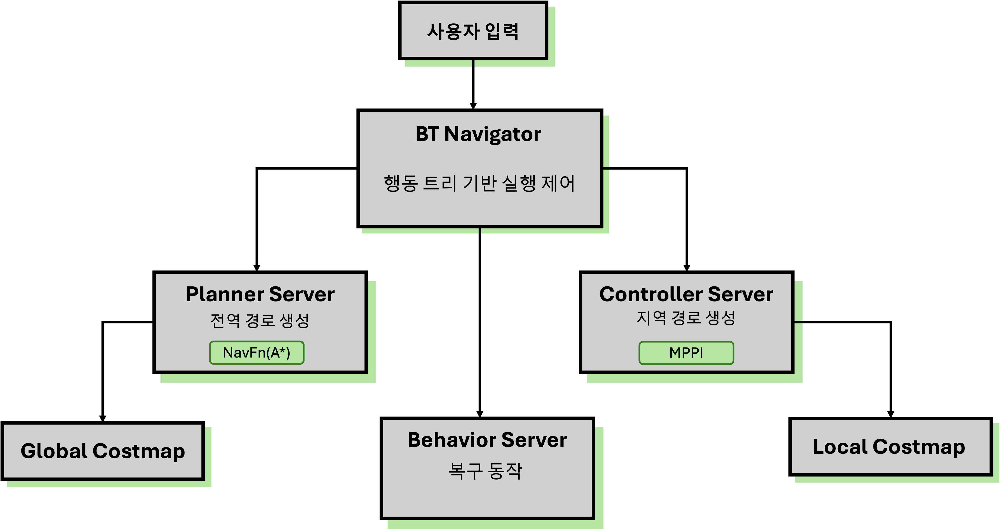

AntBot은 ROS 2의 공식 네비게이션 프레임워크인 Nav2를 통해 자율주행을 수행합니다.
4-wheel independent swerve-drive 특성에 맞춘 별도 튜닝이 적용되어 있습니다.

---

## 개요

### Nav2 파이프라인



### AntBot vs 일반 diff-drive

| 항목 | 일반 diff-drive | AntBot swerve |
|------|-----------------|---------------|
| Controller | DWB | **MPPI** (rollout 기반 최적화) |
| Motion Model (AMCL) | DifferentialMotionModel | **OmniMotionModel** |
| 속도 자유도 | vx, wz (2DOF) | **vx, vy, wz (3DOF)** |
| Costmap Inflation | ~0.3m | **0.75m** (steering 오버슈트 대비) |
| LiDAR | 단일 | **듀얼 2D** (전방 + 후방) |
| Odometry TF | 직접 발행 | **EKF 센서 퓨전** (충돌 방어) |

---

## 빠른 시작

### 의존성 설치

```bash
sudo apt install ros-humble-navigation2 ros-humble-nav2-bringup \
  ros-humble-slam-toolbox ros-humble-robot-localization \
  ros-humble-nav2-mppi-controller
```

### 실행 (3개 터미널)

**Terminal 1 — Gazebo 시뮬레이션**

```bash
ros2 launch antbot_gazebo gazebo.launch.py world:=depot
```

:::note
Gazebo 창이 나타나고 컨트롤러가 로드될 때까지 약 8~15초가 소요됩니다.
`world` 인자에는 `worlds.yaml`에 등록된 월드 이름 또는 SDF 파일의 전체 경로를 지정할 수 있습니다.
:::

**Terminal 2 — Nav2 네비게이션**

```bash
ros2 launch antbot_navigation navigation.launch.py mode:=sim world:=depot
```

:::tip
`world:=depot`을 사용하면 `worlds.yaml`에서 대응하는 맵 파일(`depot_sim.yaml`)을 자동으로 찾습니다. 맵 경로를 직접 지정하려면 `map:=` 인자를 사용하세요:
```bash
ros2 launch antbot_navigation navigation.launch.py mode:=sim \
  map:=/path/to/my_map.yaml
```
:::

**Terminal 3 — RViz 시각화**

```bash
rviz2 -d $(ros2 pkg prefix antbot_navigation --share)/rviz/navigation.rviz \
  --ros-args -p use_sim_time:=true
```

### 로봇 이동시키기

**단일 목표**: RViz에서 **2D Pose Estimate**로 초기 위치 설정 → **Nav2 Goal** 클릭

**웨이포인트 순회**: RViz → Panels → Add New Panel → `nav2_rviz_plugins/Navigation2` → Waypoint Mode 체크 → 여러 목표 클릭 → Start Waypoint Following

**CLI로 이동**:

```bash
ros2 action send_goal /navigate_to_pose nav2_msgs/action/NavigateToPose \
  "{pose: {header: {frame_id: 'map'}, pose: {position: {x: 5.0, y: 3.0}}}}"
```

### 실행 모드

| Launch 파일 | 용도 | 특징 |
|-------------|------|------|
| `navigation.launch.py` | 저장된 맵으로 자율주행 | AMCL + Nav2 전체 스택 |
| `slam.launch.py` | 맵 생성하면서 네비게이션 | SLAM Toolbox (맵 불필요) |
| `localization.launch.py` | 로컬라이제이션 전용 | 경로계획 없음, 위치 추정만 |

맵 저장: `ros2 run nav2_map_server map_saver_cli -f ~/maps/my_map`

---

## 월드 및 맵 관리

### 디렉토리 구조

월드(SDF)와 맵(PGM/YAML) 파일은 모두 `antbot_navigation/maps/`에 함께 관리됩니다:

```
antbot_navigation/maps/
├── worlds.yaml          # 월드 이름 → SDF/맵 경로 매핑
├── depot.sdf            # Gazebo 월드 파일
├── depot_sim.pgm        # 2D 점유 격자 맵
└── depot_sim.yaml       # 맵 메타데이터 (해상도, 원점 등)
```

### worlds.yaml 설정

`worlds.yaml`은 월드 이름을 SDF 파일과 Nav2 맵 파일에 매핑합니다:

```yaml
worlds:
  depot:
    sdf: depot.sdf           # Gazebo 월드 SDF
    map: depot_sim.yaml       # Nav2 맵 YAML
```

`world:=depot` 인자로 launch하면:
- **Gazebo**: `maps/depot.sdf`를 로드
- **Navigation**: `maps/depot_sim.yaml`을 맵 서버에 전달

### 새 월드 추가하기

1. **SLAM으로 맵 생성** (또는 외부에서 가져오기):

   ```bash
   # SLAM 시작
   ros2 launch antbot_navigation slam.launch.py mode:=sim
   # 맵 저장
   ros2 run nav2_map_server map_saver_cli -f ~/maps/my_world
   ```

2. **파일 배치**: `my_world.pgm`, `my_world.yaml`, `my_world.sdf`를 `antbot_navigation/maps/`에 복사

3. **worlds.yaml에 등록**:

   ```yaml
   worlds:
     depot:
       sdf: depot.sdf
       map: depot_sim.yaml
     my_world:                    # 새 월드 추가
       sdf: my_world.sdf
       map: my_world.yaml
   ```

4. **실행**:

   ```bash
   ros2 launch antbot_gazebo gazebo.launch.py world:=my_world
   ros2 launch antbot_navigation navigation.launch.py mode:=sim world:=my_world
   ```

:::note
launch 파일 수정 없이 `worlds.yaml` 편집만으로 새 월드를 추가할 수 있습니다.
`map` 인자를 직접 지정하면 `worlds.yaml`과 관계없이 임의의 맵 파일을 사용할 수도 있습니다.
:::

---

## Sim / Real 모드

모든 launch 파일은 `mode` 인자로 설정 디렉토리와 `use_sim_time`을 자동 선택합니다:

```bash
ros2 launch antbot_navigation slam.launch.py mode:=sim    # 시뮬레이션
ros2 launch antbot_navigation slam.launch.py mode:=real   # 실제 로봇
```

| 설정 | `mode:=sim` | `mode:=real` |
|------|-------------|--------------|
| Config 디렉토리 | `config/sim/` | `config/real/` |
| `use_sim_time` | `true` | `false` |
| MPPI `vx_max` | 1.0 m/s | 2.0 m/s |
| Velocity smoother | [1.5, 0.15, 1.5] | [1.0, 0.10, 1.0] |
| EKF IMU 토픽 | `/imu/data` | `/imu_node/imu/accel_gyro` |
| EKF 프로세스 노이즈 | 낮음 (이상적 센서) | 높음 (실제 노이즈) |
| MPPI `batch_size` | 2000 | 1500 (Jetson Orin) |

---

## 시스템 아키텍처

### TF 트리


| 변환 | 발행자 |
|------|--------|
| `map → odom` | AMCL 또는 SLAM Toolbox |
| `odom → base_link` | EKF (Nav2 모드) 또는 swerve controller (standalone) |
| `base_link → *` | robot_state_publisher |

### odom TF 전환 메커니즘

:::caution
swerve controller와 EKF가 동시에 `odom→base_link` TF를 발행하면 진동이 발생합니다.
navigation launch가 자동으로 swerve controller의 TF 발행을 비활성화하며,
Nav2 노드는 EKF가 TF를 발행할 수 있도록 8초 지연 후 시작됩니다.
진동이 보이면 수동으로 비활성화하세요:

```bash
ros2 param set /antbot_swerve_controller enable_odom_tf false
```
:::

---

## 파라미터 설정

설정 파일 위치: `antbot_navigation/config/{sim,real}/`

### MPPI 컨트롤러

AntBot의 스티어링 리밋은 **±60도**로, 순수 횡이동(crab)은 물리적으로 불가능합니다.
방향 전환은 **제자리 회전 → 직진** 패턴으로 수행되며, MPPI 파라미터가 이에 맞게 튜닝되어 있습니다.

```yaml
FollowPath:
  plugin: "nav2_mppi_controller::MPPIController"
  motion_model: "Omni"
  time_steps: 56           # 2.8초 미래 예측
  batch_size: 2000
  vx_max: 1.0              # sim (real: 2.0)
  vy_max: 0.1              # 횡방향 거의 비활성화 (±60도 스티어링 제한)
```

#### MPPI Critics

| Critic | 가중치 | 역할 |
|--------|--------|------|
| ConstraintCritic | 4.0 | 속도 제약 위반 페널티 |
| GoalCritic | 5.0 | 목표 접근 보상 |
| **PreferForwardCritic** | **15.0** | **헤딩을 이동 방향에 강하게 정렬 (스워브 핵심)** |
| **PathAngleCritic** | **15.0** | **body 각도 = 경로 방향 (스워브 핵심)** |
| **TwirlingCritic** | **10.0** | **불필요한 회전 억제 (스워브 핵심)** |
| ObstaclesCritic | — | 장애물 충돌 회피 |
| PathAlignCritic | 10.0 | 궤적-경로 정렬 |
| PathFollowCritic | 5.0 | 글로벌 경로 추종 |

:::note[스티어링 리밋과 MPPI 튜닝]
`vy_max`를 0.1로 제한하고 `PreferForwardCritic`, `PathAngleCritic` 가중치를 높여서,
MPPI가 횡이동 대신 **먼저 제자리 회전으로 헤딩을 맞춘 뒤 직진**하도록 유도합니다.
`vy_max`를 높이면 스티어링이 리밋에 걸려 부자연스러운 움직임이 발생합니다.
:::

### AMCL

```yaml
amcl:
  robot_model_type: "nav2_amcl::OmniMotionModel"  # 홀로노믹 필수
  scan_topic: /scan_0
```

:::caution
`OmniMotionModel`은 스워브 로봇에 **필수**입니다. 기본 `DifferentialMotionModel`을 사용하면 횡이동(vy)을 모델링하지 못해 localization 정확도가 크게 떨어집니다.
:::

### EKF 센서 퓨전

```yaml
odom0: /odom                    # vx, vy, vyaw
imu0: /imu/data                 # yaw, vyaw (differential mode) — sim
# imu0: /imu_node/imu/accel_gyro  # real robot
odom0_rejection_threshold: 2.0  # 충돌 스파이크 거부
```

:::note[충돌 보호]
벽 충돌 시 바퀴 슬립으로 wheel velocity 스파이크가 발생하면 `odom0_rejection_threshold`로 자동 무시되어 odom 드리프트를 방지합니다.
:::

:::caution[Sim vs Real IMU 토픽]
시뮬레이션에서는 Gazebo ros_gz_bridge가 IMU를 `/imu/data`로 발행하고, 실제 로봇에서는 `/imu_node/imu/accel_gyro`를 사용합니다. `config/sim/ekf.yaml`과 `config/real/ekf.yaml`에 각각 올바른 토픽이 설정되어 있습니다.
:::

### Costmap

로봇 풋프린트 0.70m x 0.60m, 듀얼 LiDAR(`/scan_0` 전방 + `/scan_1` 후방).

| 항목 | Local Costmap | Global Costmap |
|------|---------------|----------------|
| Frame | `odom` | `map` |
| 크기 | 5m x 5m rolling | 전체 맵 |
| 업데이트 | 5Hz | 1Hz |
| 레이어 | obstacle x2 + inflation | static + obstacle x2 + inflation |

---

## 트러블슈팅

### "Failed to create plan"

코스트맵에서 로봇이 장애물 내부에 위치. RViz에서 **2D Pose Estimate**로 수정, 또는:

```bash
ros2 service call /global_costmap/clear_entirely_global_costmap nav2_msgs/srv/ClearEntireCostmap
```

### 벽 충돌

1. `inflation_radius` 증가 (0.75 → 1.0)
2. `cost_scaling_factor` 감소 (1.5 → 1.0)
3. `ObstaclesCritic.collision_margin_distance` 증가

### crab-walking (옆으로 걸음)

`vy_max`를 줄이거나, `PreferForwardCritic` 가중치 증가.
스티어링 리밋(±60도) 이내에서만 횡이동이 가능하므로, `vy_max: 0.1` 이하 권장.

### map 프레임 없음 / TF 타임아웃

Gazebo를 재시작한 경우 sim time이 0으로 리셋되어 모든 TF 버퍼가 깨집니다.
**Gazebo와 Navigation을 항상 함께 재시작**하세요.

### 진단 명령어

```bash
ros2 topic hz /scan_0                    # LiDAR 확인
ros2 topic hz /odometry/filtered         # EKF 출력 확인
ros2 run tf2_ros tf2_echo map odom       # TF 확인
ros2 param get /antbot_swerve_controller enable_odom_tf
ros2 lifecycle get /controller_server    # Nav2 상태
ros2 control list_controllers            # 컨트롤러 상태
```

:::tip
`/cmd_vel`과 `/odom`의 상세 메시지 정의는 [5.2 주요 ROS 토픽/서비스](/antbot/development-guide/ros-topics/)를 참고하세요.
시뮬레이션 환경의 상세 설정은 [5.4 시뮬레이션 환경 구축](/antbot/development-guide/simulation/)을 참고하세요.
:::
