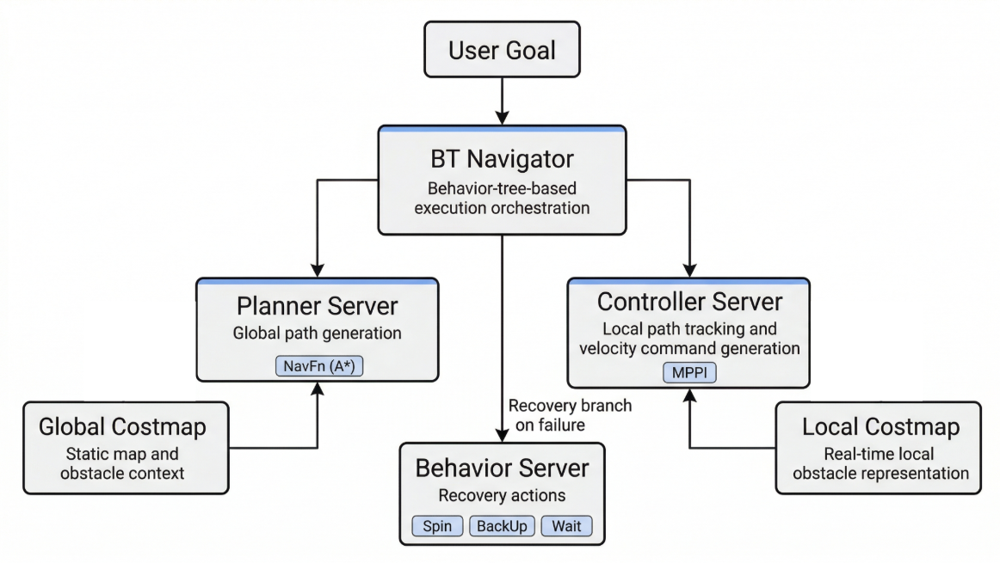
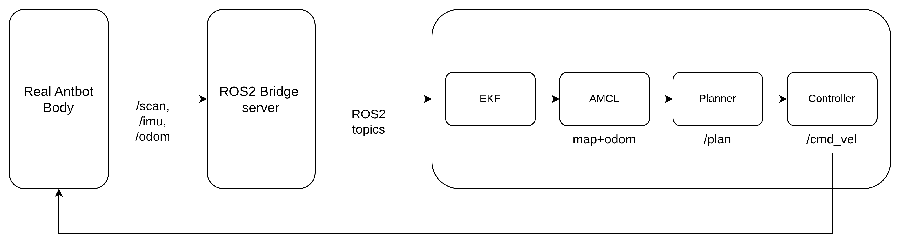

AntBot은 ROS 2의 공식 네비게이션 프레임워크인 Nav2를 통해 자율주행을 수행합니다.
4-wheel independent swerve-drive 특성에 맞춘 별도 튜닝이 적용되어 있습니다.

---

## 개요

### Nav2 파이프라인



### AntBot vs 일반 diff-drive

| 항목 | 일반 diff-drive | AntBot swerve |
|------|-----------------|---------------|
| Controller | DWB | **MPPI** (rollout 기반 최적화) |
| Motion Model (AMCL) | DifferentialMotionModel | **OmniMotionModel** |
| 속도 자유도 | vx, wz (2DOF) | **vx, vy, wz (3DOF)** |
| Costmap Inflation | ~0.3m | **0.75m** (steering 오버슈트 대비) |
| LiDAR | 단일 | **듀얼 2D** (전방 + 후방) |
| Odometry TF | 직접 발행 | **EKF 센서 퓨전** (충돌 방어) |

---

## 빠른 시작

### 의존성 설치

```bash
# Nav2 네비게이션 스택, SLAM, EKF 센서 퓨전, MPPI 컨트롤러 설치
sudo apt install ros-humble-navigation2 ros-humble-nav2-bringup \
  ros-humble-slam-toolbox ros-humble-robot-localization \
  ros-humble-nav2-mppi-controller
```

:::note
Gazebo 시뮬레이션 환경의 의존성 설치는 [5.4 시뮬레이션 환경 구축 — 의존성 설치](/antbot/development-guide/simulation/#의존성-설치)를 참고하세요.
:::

### 실행 (3개 터미널)

**Terminal 1 — Gazebo 시뮬레이션**

```bash
# Gazebo 시뮬레이터와 로봇 모델을 실행합니다
ros2 launch antbot_gazebo gazebo.launch.py world:=depot
```

**Terminal 2 — Nav2 네비게이션**

```bash
# EKF + AMCL + Nav2 전체 네비게이션 스택을 실행합니다
ros2 launch antbot_navigation navigation.launch.py mode:=sim world:=depot
```

**Terminal 3 — RViz 시각화**

```bash
# Nav2 전용 RViz 설정 파일로 시각화 도구를 실행합니다
rviz2 -d $(ros2 pkg prefix antbot_navigation --share)/rviz/navigation.rviz \
  --ros-args -p use_sim_time:=true
```

:::note
Gazebo 창이 나타나고 컨트롤러가 로드될 때까지 약 8~15초가 소요됩니다.
`world` 인자에는 `worlds.yaml`에 등록된 월드 이름 또는 SDF 파일의 전체 경로를 지정할 수 있습니다.
:::

---

## 실행 모드

### Launch 파일 비교

| Launch 파일 | 용도 | 특징 |
|-------------|------|------|
| `navigation.launch.py` | 저장된 맵으로 자율주행 | AMCL + Nav2 전체 스택 |
| `slam.launch.py` | 맵 생성과 동시에 네비게이션 | SLAM Toolbox (사전 맵 불필요) |
| `localization.launch.py` | 위치 추정 전용 | 경로 계획 없음, EKF + AMCL만 실행 |

```bash
# SLAM으로 생성한 맵을 파일로 저장합니다
ros2 run nav2_map_server map_saver_cli -f ~/maps/my_map
```

### Sim / Real 모드

모든 launch 파일은 `mode` 인자로 설정 디렉토리와 `use_sim_time`을 자동 선택합니다:

```bash
# 시뮬레이션 환경에서 실행 (Gazebo 시간 사용)
ros2 launch antbot_navigation slam.launch.py mode:=sim
# 실제 로봇에서 실행 (시스템 시간 사용)
ros2 launch antbot_navigation slam.launch.py mode:=real
```

| 설정 | `mode:=sim` | `mode:=real` |
|------|-------------|--------------|
| Config 디렉토리 | `config/sim/` | `config/real/` |
| `use_sim_time` | `true` | `false` |
| MPPI `vx_max` | 1.0 m/s | 2.0 m/s |
| Velocity smoother | [1.5, 0.15, 1.5] | [1.0, 0.10, 1.0] |
| EKF IMU 토픽 | `/imu/data` | `/imu_node/imu/accel_gyro` |
| EKF 프로세스 노이즈 | 낮음 (이상적 센서) | 높음 (실제 노이즈) |
| MPPI `batch_size` | 2000 | 1500 (Jetson Orin) |

### 네비게이션 목표 설정

**단일 목표 지점 지정**

1. RViz에서 **2D Pose Estimate**를 클릭하여 로봇의 초기 위치를 설정합니다
2. **Nav2 Goal**을 클릭하여 목표 지점을 지정합니다

**다중 웨이포인트 순회**

RViz → Panels → Add New Panel → `nav2_rviz_plugins/Navigation2` → Waypoint Mode 체크 → 여러 목표 클릭 → Start Waypoint Following

**CLI를 통한 목표 설정**

```bash
# map 프레임 기준 좌표 (x: 5.0, y: 3.0)로 네비게이션 목표를 전송합니다
ros2 action send_goal /navigate_to_pose nav2_msgs/action/NavigateToPose \
  "{pose: {header: {frame_id: 'map'}, pose: {position: {x: 5.0, y: 3.0}}}}"
```

:::tip
`world:=depot`을 사용하면 `worlds.yaml`에서 대응하는 맵 파일(`depot_sim.yaml`)을 자동으로 찾습니다. 맵 경로를 직접 지정하려면 `map:=` 인자를 사용하세요:
```bash
ros2 launch antbot_navigation navigation.launch.py mode:=sim \
  map:=/path/to/my_map.yaml
```
:::

---

## 시스템 아키텍처

### TF 트리



| 변환 | 발행자 | 입력 데이터 | 출력 |
|------|--------|-------------|------|
| `map → odom` | AMCL 또는 SLAM Toolbox | LiDAR 스캔 (`/scan_0`) + 맵 데이터 | 글로벌 위치 보정 |
| `odom → base_link` | EKF (Nav2 모드) 또는 swerve controller (standalone) | 바퀴 오도메트리 (`/odom`) + IMU | 로봇 이동량 추정 |
| `base_link → *` | robot_state_publisher | URDF 모델 | 센서/바퀴 프레임 위치 |

### odom TF 전환 메커니즘

:::caution
swerve controller와 EKF가 동시에 `odom→base_link` TF를 발행하면 진동이 발생합니다.
navigation launch가 자동으로 swerve controller의 TF 발행을 비활성화하며,
Nav2 노드는 EKF가 TF를 발행할 수 있도록 8초 지연 후 시작됩니다.
진동이 보이면 수동으로 비활성화하세요:

```bash
# swerve controller의 odom TF 발행을 비활성화합니다
ros2 param set /antbot_swerve_controller enable_odom_tf false
```
:::

---

## 파라미터 튜닝

설정 파일 위치: `antbot_navigation/config/{sim,real}/`

| 컴포넌트 | 역할 | 설정 파일 |
|----------|------|-----------|
| **MPPI 컨트롤러** | 후보 경로를 생성하고 최적 경로를 선택하여 로봇을 이동 | `nav2_params.yaml` |
| **AMCL** | LiDAR 스캔과 맵을 비교하여 로봇의 현재 위치를 추정 | `nav2_params.yaml` |
| **EKF** | 바퀴 오도메트리와 IMU 데이터를 결합하여 위치 정확도 향상 | `ekf.yaml` |
| **SLAM Toolbox** | 실시간으로 맵을 생성하면서 위치를 추정 | `slam_toolbox_params.yaml` |
| **Costmap** | 센서 데이터로 장애물 지도를 생성하여 충돌 회피 | `nav2_params.yaml` |

### MPPI 컨트롤러 (경로 추종)

MPPI(Model Predictive Path Integral)는 수천 개의 후보 경로를 시뮬레이션한 뒤, 점수가 가장 높은 경로를 선택하는 컨트롤러입니다.

AntBot의 스티어링은 **±60도**까지만 꺾을 수 있어서, 옆으로 이동하는 것이 물리적으로 불가능합니다.
따라서 방향을 바꿀 때는 **제자리 회전 → 직진** 패턴으로 움직이며, 아래 파라미터가 이에 맞게 설정되어 있습니다.

**핵심 속도 파라미터**

| 파라미터 | Sim | Real | 설명 |
|----------|-----|------|------|
| `vx_max` | 1.0 | 2.0 | 전진 최대 속도 (m/s). 실제 로봇이 더 빠르게 설정됨 |
| `vy_max` | 0.1 | 0.5 | 횡방향 최대 속도 (m/s). **낮을수록 직진 위주로 이동** |
| `wz_max` | 1.5 | 2.0 | 회전 최대 속도 (rad/s) |
| `batch_size` | 2000 | 1500 | 한 번에 생성하는 후보 경로 수. 많을수록 정밀하지만 연산량 증가 |
| `time_steps` | 56 | 56 | 미래 예측 단계 수. `model_dt`(0.05초)와 곱하여 예측 시간 결정 |

:::note[time_steps, vy_max 설정 근거]
- **예측 시간**: `time_steps × model_dt = 56 × 0.05초 = 2.8초`. 늘리면 더 먼 미래를 예측하지만 연산량이 증가합니다.
- **vy_max가 낮은 이유**: 낮게 설정하면 MPPI가 횡이동 경로를 거의 생성하지 않습니다. 스티어링이 ±60도 한계에 걸리면 부자연스러운 움직임이 발생하기 때문입니다.
:::

**MPPI Critics (경로 평가 기준)** — 후보 경로마다 여러 평가 기준(Critic)으로 점수를 매깁니다. 가중치가 높을수록 해당 기준이 경로 선택에 더 큰 영향을 줍니다.

스워브 방향 제어 — AntBot이 직진 위주로 움직이도록 유도하는 핵심 설정:

| Critic | Sim | Real | 설명 |
|--------|-----|------|------|
| `PreferForwardCritic` | 15.0 | 5.0 | 로봇이 앞을 보고 이동하도록 유도. 높을수록 후진/횡이동 억제 |
| `PathAngleCritic` | 15.0 | 5.0 | 로봇의 방향과 경로 방향을 일치시킴. 높을수록 경로를 따라 정렬 |
| `TwirlingCritic` | 10.0 | 5.0 | 불필요한 제자리 회전을 억제. 높을수록 안정적 직진 |

경로 추종 및 안전:

| Critic | 가중치 | 설명 |
|--------|--------|------|
| `GoalCritic` | 5.0 | 목표 지점에 가까운 경로에 높은 점수 |
| `PathAlignCritic` | 10.0 | 글로벌 경로와 후보 경로의 정렬도 평가 |
| `PathFollowCritic` | 5.0 | 글로벌 경로를 벗어나지 않도록 유도 |
| `ObstaclesCritic` | — | 장애물에 가까운 경로에 페널티. `collision_cost: 10000`으로 충돌 경로 차단 |
| `ConstraintCritic` | 4.0 | 최대 속도/가속도 제한을 위반하는 경로에 페널티 |

:::tip[Sim vs Real 가중치 차이]
시뮬레이션에서는 마찰이 없어 로봇이 쉽게 미끄러지므로 방향 제어 가중치를 높게 설정합니다.
실제 로봇은 바퀴와 지면의 마찰이 자연스러운 직진을 유도하므로 가중치가 낮아도 됩니다.
:::

### AMCL (위치 추정)

AMCL은 LiDAR 스캔 데이터를 저장된 맵과 비교하여 로봇의 현재 위치를 추정합니다.

```yaml
amcl:
  robot_model_type: "nav2_amcl::OmniMotionModel"
  scan_topic: /scan_0
```

:::caution[OmniMotionModel 필수]
AntBot은 전후좌우로 이동할 수 있는 스워브 로봇이므로, 모든 방향의 움직임을 인식하는 `OmniMotionModel`이 필요합니다.
일반적인 2륜 로봇(diff-drive)은 앞뒤로만 이동하므로 `DifferentialMotionModel`로 충분하지만,
AntBot처럼 좌우 이동(vy)이 가능한 로봇에서 이 모델을 사용하면 좌우 움직임을 인식하지 못해 위치 추정이 부정확해집니다.
:::

### EKF 센서 퓨전 (오도메트리 보정)

EKF(Extended Kalman Filter)는 바퀴 오도메트리와 IMU 센서 데이터를 결합하여, 각각의 센서만 사용할 때보다 더 정확한 위치를 계산합니다.

| 설정 | Sim | Real | 설명 |
|------|-----|------|------|
| 오도메트리 토픽 | `/odom` | `/odom` | 바퀴에서 계산한 속도 (vx, vy, vyaw) |
| IMU 토픽 | `/imu/data` | `/imu_node/imu/accel_gyro` | 자이로/가속도 센서 (yaw, vyaw) |
| 프로세스 노이즈 | 낮음 | 높음 | 실제 센서 노이즈가 더 크므로 불확실성을 높게 설정 |
| `odom0_rejection_threshold` | 2.0 | 1.5 | 이 값을 초과하는 오도메트리 데이터는 무시 |

벽 충돌 시 바퀴가 미끄러지면서 오도메트리에 비정상적으로 큰 속도값이 발생할 수 있습니다. `odom0_rejection_threshold`가 이런 스파이크를 자동으로 무시하여, 충돌 후에도 위치 추정이 크게 틀어지지 않도록 보호합니다.

:::caution[Sim vs Real IMU 토픽]
시뮬레이션에서는 Gazebo ros_gz_bridge가 IMU를 `/imu/data`로 발행하고, 실제 로봇에서는 `/imu_node/imu/accel_gyro`를 사용합니다. `config/sim/ekf.yaml`과 `config/real/ekf.yaml`에 각각 올바른 토픽이 설정되어 있습니다.
:::

### SLAM Toolbox (실시간 맵 생성)

SLAM Toolbox는 LiDAR 데이터를 사용하여 실시간으로 맵을 생성하면서 동시에 위치를 추정합니다.
`slam.launch.py`에서 사용되며, 사전에 저장된 맵이 필요하지 않습니다.

| 파라미터 | Sim | Real | 설명 |
|----------|-----|------|------|
| `max_laser_range` | 20.0 | 12.0 | LiDAR 최대 사용 거리 (m). 실제 LiDAR 성능에 맞게 축소 |
| `minimum_travel_distance` | 0.5 | 0.3 | 새 스캔을 맵에 추가하는 최소 이동 거리 (m) |
| `minimum_travel_heading` | 0.5 | 0.4 | 새 스캔을 맵에 추가하는 최소 회전량 (rad) |
| `resolution` | 0.05 | 0.05 | 맵 격자 해상도 (m/pixel). 5cm 단위 |
| `map_update_interval` | 5.0 | 5.0 | 맵 업데이트 주기 (초) |

:::tip[Sim vs Real 차이]
실제 로봇에서는 LiDAR 노이즈가 더 크므로 `max_laser_range`를 줄이고,
더 촘촘한 스캔 삽입(`minimum_travel_distance: 0.3`)으로 맵 품질을 보완합니다.
루프 클로저 임계값도 더 엄격하게 설정하여 잘못된 루프 클로저를 방지합니다.
:::

### Costmap (장애물 지도)

Costmap은 센서 데이터를 기반으로 로봇 주변의 장애물 정보를 격자 형태로 관리합니다. 로봇은 이 지도를 참고하여 장애물을 피해 경로를 계획합니다.

AntBot은 전방(`/scan_0`)과 후방(`/scan_1`) 듀얼 2D LiDAR를 사용하여 360도 장애물을 감지합니다.

- **로봇 풋프린트**: 0.70m x 0.60m
- **팽창 반경** (`inflation_radius`): 0.75m — 장애물 주변에 여유 공간을 확보하여 스티어링 오버슈트에 대비

| 항목 | Local Costmap | Global Costmap |
|------|---------------|----------------|
| 기준 프레임 | `odom` | `map` |
| 크기 | 5m x 5m (로봇 주변만) | 전체 맵 |
| 업데이트 주기 | 5Hz (빠르게, 근거리 반응) | 1Hz (느리게, 전체 경로용) |
| 레이어 | obstacle x2 + inflation | static + obstacle x2 + inflation |

---

## 월드 및 맵 관리

### 디렉토리 구조

월드(SDF)와 맵(PGM/YAML) 파일은 모두 `antbot_navigation/maps/`에 함께 관리됩니다:

```
antbot_navigation/maps/
├── worlds.yaml          # 월드 이름 → SDF/맵 경로 매핑
├── depot.sdf            # Gazebo 월드 파일
├── depot_sim.pgm        # 2D 점유 격자 맵
└── depot_sim.yaml       # 맵 메타데이터 (해상도, 원점 등)
```

### worlds.yaml 설정

`worlds.yaml`은 월드 이름을 SDF 파일과 Nav2 맵 파일에 매핑합니다:

```yaml
worlds:
  depot:
    sdf: depot.sdf           # Gazebo 월드 SDF
    map: depot_sim.yaml       # Nav2 맵 YAML
```

`world:=depot` 인자로 launch하면:
- **Gazebo**: `maps/depot.sdf`를 로드
- **Navigation**: `maps/depot_sim.yaml`을 맵 서버에 전달

### 커스텀 월드 등록

1. **SLAM으로 맵 생성** (또는 외부에서 가져오기):

   ```bash
   # SLAM 모드로 실행하여 실시간으로 맵을 생성합니다
   ros2 launch antbot_navigation slam.launch.py mode:=sim
   # 생성된 맵을 파일로 저장합니다
   ros2 run nav2_map_server map_saver_cli -f ~/maps/my_world
   ```

2. **파일 배치**: `my_world.pgm`, `my_world.yaml`, `my_world.sdf`를 `antbot_navigation/maps/`에 복사

3. **worlds.yaml에 등록**:

   ```yaml
   worlds:
     depot:
       sdf: depot.sdf
       map: depot_sim.yaml
     my_world:                    # 새 월드 추가
       sdf: my_world.sdf
       map: my_world.yaml
   ```

4. **실행**:

   ```bash
   # 등록한 커스텀 월드로 시뮬레이션을 실행합니다
   ros2 launch antbot_gazebo gazebo.launch.py world:=my_world
   ros2 launch antbot_navigation navigation.launch.py mode:=sim world:=my_world
   ```

:::note
launch 파일 수정 없이 `worlds.yaml` 편집만으로 새 월드를 추가할 수 있습니다.
`map` 인자를 직접 지정하면 `worlds.yaml`과 관계없이 임의의 맵 파일을 사용할 수도 있습니다.
:::

---

## 트러블슈팅

### 경로 생성(Failed to create plan) 실패 시

코스트맵에서 로봇이 장애물 내부에 위치한 경우 발생합니다.

RViz에서 **2D Pose Estimate**로 초기 위치를 수정하거나, 코스트맵을 초기화합니다:

```bash
ros2 service call /global_costmap/clear_entirely_global_costmap nav2_msgs/srv/ClearEntireCostmap
```

### 벽 충돌 및 장애물 회피 실패 경우

장애물과의 안전 여유 공간이 부족한 경우 발생합니다.

- `inflation_radius` 증가 (0.75 → 1.0)
- `cost_scaling_factor` 감소 (1.5 → 1.0)
- `ObstaclesCritic.collision_margin_distance` 증가 (0.1 → 0.2)

### 제자리 과도 회전 발생 대응

목표를 향해 이동하지 않고 계속 회전만 하는 경우입니다.

- `TwirlingCritic` 가중치 증가 (10.0 → 15.0)
- `wz_max` 감소 (1.5 → 1.0)
- `PreferForwardCritic` 가중치 감소 (15.0 → 10.0)

### map 프레임 누락 및 TF 타임아웃 발생 시

Gazebo를 재시작하면 sim time이 0으로 리셋되어 모든 TF 버퍼가 깨집니다.

**Gazebo와 Navigation을 항상 함께 재시작**하세요.

### 진단 명령어

```bash
# LiDAR 데이터 수신 주기 확인 (정상: ~10Hz)
ros2 topic hz /scan_0
# EKF 센서 퓨전 출력 확인 (정상: ~50Hz)
ros2 topic hz /odometry/filtered
# map → odom TF 변환 상태 확인
ros2 run tf2_ros tf2_echo map odom
# swerve controller의 odom TF 발행 상태 확인
ros2 param get /antbot_swerve_controller enable_odom_tf
# Nav2 컨트롤러 서버 라이프사이클 상태 확인
ros2 lifecycle get /controller_server
# ros2_control 컨트롤러 목록 및 상태 확인
ros2 control list_controllers
```

:::tip
`/cmd_vel`과 `/odom`의 상세 메시지 정의는 [5.2 주요 ROS 토픽/서비스](/antbot/development-guide/ros-topics/)를 참고하세요.
시뮬레이션 환경의 상세 설정은 [5.4 시뮬레이션 환경 구축](/antbot/development-guide/simulation/)을 참고하세요.
:::
