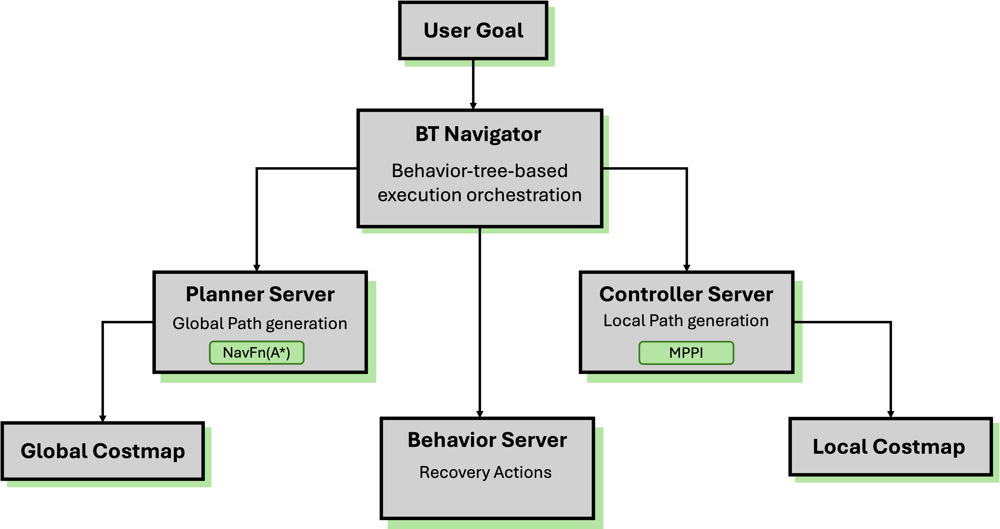

AntBot uses Nav2, the official ROS 2 navigation framework, for autonomous driving.
Custom tuning is applied for the 4-wheel independent swerve-drive characteristics.

---

## Overview

### Nav2 Pipeline



### AntBot vs Standard diff-drive

| Aspect | Standard diff-drive | AntBot swerve |
|--------|---------------------|---------------|
| Controller | DWB | **MPPI** (rollout-based optimization) |
| Motion Model (AMCL) | DifferentialMotionModel | **OmniMotionModel** |
| Velocity DOF | vx, wz (2DOF) | **vx, vy, wz (3DOF)** |
| Costmap Inflation | ~0.3m | **0.75m** (steering overshoot margin) |
| LiDAR | Single | **Dual 2D** (front + back) |
| Odometry TF | Direct publish | **EKF sensor fusion** (collision protection) |

---

## Quick Start

### Prerequisites

```bash
sudo apt install ros-humble-navigation2 ros-humble-nav2-bringup \
  ros-humble-slam-toolbox ros-humble-robot-localization \
  ros-humble-nav2-mppi-controller
```

### Run (3 Terminals)

**Terminal 1 — Gazebo Simulation**

```bash
ros2 launch antbot_gazebo gazebo.launch.py \
  world:=$(ros2 pkg prefix antbot_gazebo --share)/worlds/depot.sdf
```

:::note
Wait ~8-15 seconds for the Gazebo window and controller spawners to complete.
The default world is `empty.sdf`; use the depot world to match the `depot_sim` map.
:::

**Terminal 2 — Nav2 Navigation**

```bash
ros2 launch antbot_navigation navigation.launch.py mode:=sim \
  map:=$(ros2 pkg prefix antbot_navigation --share)/maps/depot_sim.yaml
```

**Terminal 3 — RViz**

```bash
rviz2 -d $(ros2 pkg prefix antbot_navigation --share)/rviz/navigation.rviz \
  --ros-args -p use_sim_time:=true
```

### Controlling the Robot

**Single goal**: In RViz, click **2D Pose Estimate** to set initial pose → click **Nav2 Goal**

**Waypoint following**: RViz → Panels → Add New Panel → `nav2_rviz_plugins/Navigation2` → check Waypoint Mode → click multiple goals → Start Waypoint Following

**CLI**:

```bash
ros2 action send_goal /navigate_to_pose nav2_msgs/action/NavigateToPose \
  "{pose: {header: {frame_id: 'map'}, pose: {position: {x: 5.0, y: 3.0}}}}"
```

### Navigation Modes

| Launch file | Purpose | Features |
|-------------|---------|----------|
| `navigation.launch.py` | Autonomous driving with saved map | AMCL + full Nav2 stack |
| `slam.launch.py` | Build map while navigating | SLAM Toolbox (no map needed) |
| `localization.launch.py` | Localization only | No planning, position estimation only |

Save map: `ros2 run nav2_map_server map_saver_cli -f ~/maps/my_map`

---

## Sim / Real Mode

All launch files accept a `mode` argument that auto-selects the config directory and `use_sim_time`:

```bash
ros2 launch antbot_navigation slam.launch.py mode:=sim    # simulation
ros2 launch antbot_navigation slam.launch.py mode:=real   # real robot
```

| Setting | `mode:=sim` | `mode:=real` |
|---------|-------------|--------------|
| Config directory | `config/sim/` | `config/real/` |
| `use_sim_time` | `true` | `false` |
| MPPI `vx_max` | 5.0 m/s | 2.0 m/s |
| Velocity smoother | [1.5, 0.15, 1.5] | [1.0, 0.10, 1.0] |
| EKF process noise | Low (ideal sensors) | Higher (real noise) |
| MPPI `batch_size` | 2000 | 1500 (Jetson Orin) |

---

## System Architecture

### TF Tree


| Transform | Publisher |
|-----------|----------|
| `map → odom` | AMCL or SLAM Toolbox |
| `odom → base_link` | EKF (Nav2 mode) or swerve controller (standalone) |
| `base_link → *` | robot_state_publisher |

### odom TF Handover

:::caution
If both swerve controller and EKF publish `odom→base_link` TF simultaneously, jitter occurs.
Navigation launch auto-disables the controller's TF publish,
and Nav2 nodes start with an 8-second delay to allow EKF to establish the TF first.
If you see jitter, disable manually:

```bash
ros2 param set /antbot_swerve_controller enable_odom_tf false
```
:::

---

## Configuration

Config files: `antbot_navigation/config/{sim,real}/`

### MPPI Controller

```yaml
FollowPath:
  plugin: "nav2_mppi_controller::MPPIController"
  motion_model: "Omni"
  time_steps: 56           # 2.8s lookahead
  batch_size: 2000
  vx_max: 5.0              # sim (real: 2.0)
  vy_max: 1.0              # limit lateral motion (sim, real: 0.5)
```

#### MPPI Critics

| Critic | Weight | Purpose |
|--------|--------|---------|
| ConstraintCritic | 4.0 | Velocity constraint violation penalty |
| GoalCritic | 5.0 | Goal approach reward |
| **PreferForwardCritic** | **5.0** | **Forward-facing travel (swerve key)** |
| **PathAngleCritic** | **5.0** | **Body angle = path direction (swerve key)** |
| **TwirlingCritic** | **5.0** | **Suppress unnecessary spinning (swerve key)** |
| ObstaclesCritic | — | Collision avoidance |
| PathAlignCritic | 10.0 | Trajectory-path alignment |
| PathFollowCritic | 5.0 | Global path following |

### AMCL

```yaml
amcl:
  robot_model_type: "nav2_amcl::OmniMotionModel"  # required for holonomic
  scan_topic: /scan_0
```

:::caution
`OmniMotionModel` is **required** for swerve robots. The default `DifferentialMotionModel` cannot model lateral motion (vy), significantly degrading localization accuracy.
:::

### EKF Sensor Fusion

```yaml
odom0: /odom                    # vx, vy, vyaw
imu0: /imu/data                 # yaw, vyaw (differential mode) — sim
# imu0: /imu_node/imu/accel_gyro  # real robot
odom0_rejection_threshold: 2.0  # reject collision spikes
```

:::caution[Sim vs Real IMU Topic]
In simulation, Gazebo ros_gz_bridge publishes IMU on `/imu/data`, while the real robot uses `/imu_node/imu/accel_gyro`. The correct topic is configured in `config/sim/ekf.yaml` and `config/real/ekf.yaml` respectively.
:::

### Costmap

Robot footprint 0.70m × 0.60m, dual LiDAR (`/scan_0` front + `/scan_1` back).

| Aspect | Local Costmap | Global Costmap |
|--------|---------------|----------------|
| Frame | `odom` | `map` |
| Size | 5m × 5m rolling | Full map |
| Update | 5Hz | 1Hz |
| Layers | obstacle×2 + inflation | static + obstacle×2 + inflation |

---

## Troubleshooting

### "Failed to create plan"

Robot is inside an obstacle on the costmap. Use **2D Pose Estimate** in RViz, or:

```bash
ros2 service call /global_costmap/clear_entirely_global_costmap nav2_msgs/srv/ClearEntireCostmap
```

### Wall collision

1. Increase `inflation_radius` (0.75 → 1.0)
2. Decrease `cost_scaling_factor` (1.5 → 1.0)
3. Increase `ObstaclesCritic.collision_margin_distance`

### Crab-walking

Reduce `vy_max` or increase `PreferForwardCritic` weight.

### Diagnostic Commands

```bash
ros2 topic hz /scan_0
ros2 run tf2_ros tf2_echo map odom
ros2 param get /antbot_swerve_controller enable_odom_tf
ros2 lifecycle get /controller_server
```

:::tip
For `/cmd_vel` and `/odom` topic specifications, see [5.2 Key ROS Topics/Services](/antbot/en/development-guide/ros-topics/).
For simulation environment details, see [5.4 Simulation Environment Setup](/antbot/en/development-guide/simulation/).
:::
