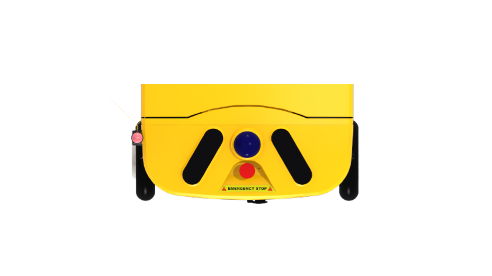

import { Badge, Steps } from '@astrojs/starlight/components';

The emergency stop button is a safety device that immediately stops the robot in emergency situations.

---

## How It Works

When the emergency stop button is pressed,

<Steps>

1. **All drive motors stop immediately.**

2. **Torque is maintained** so the robot does not slide on slopes.

3. The `Estop_State` on the RCU board changes to <Badge text="ON" variant="danger" />.

</Steps>

---

## Releasing the Emergency Stop

To release the emergency stop, **twist the button clockwise to pop it up**.

:::caution
Even after releasing the emergency stop, the motors do not operate immediately.
Driving is only possible after the motor state transitions through `IDLE` → `READY_ENTER` → `READY`.

:::
