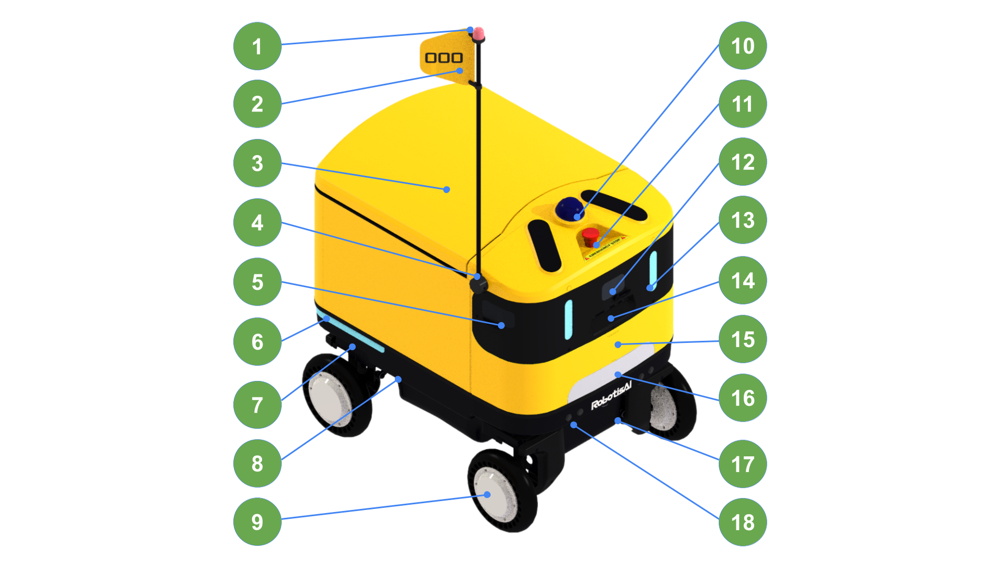
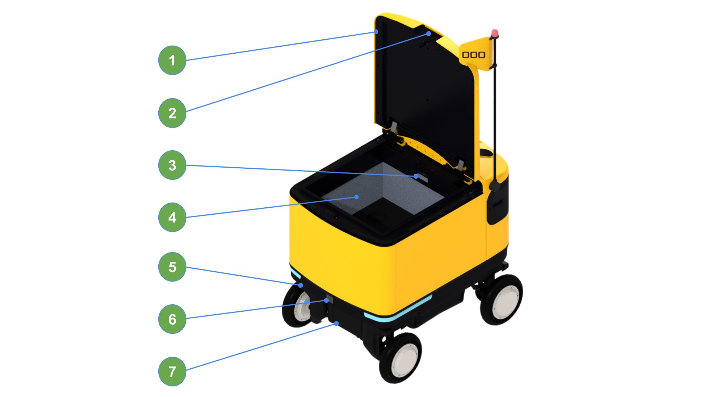
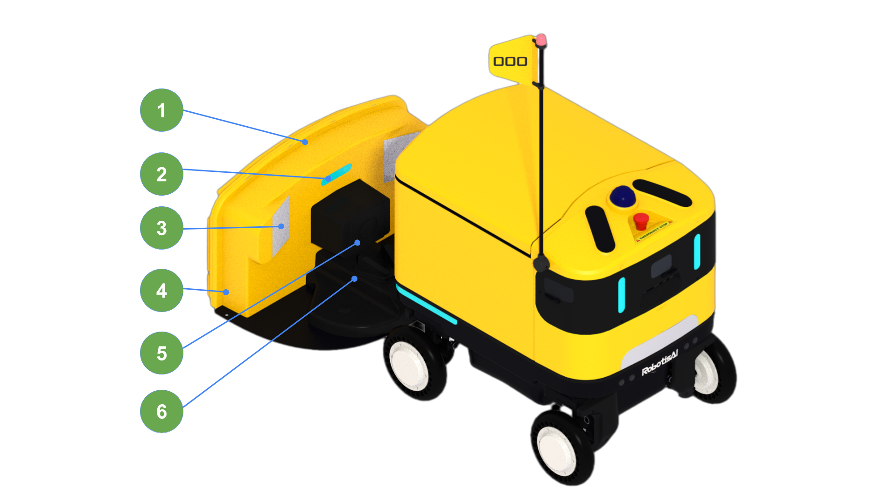

These are the key exterior components of AntBot.

## Front

| No. | Name |
| :---: | :--- |
| 1 | Flag Pole LED |
| 2 | Flag |
| 3 | Cargo |
| 4 | Foldable Flag Pole |
| 5 | Wiper |
| 6 | Indicator |
| 7 | 2D LiDAR (Rear) |
| 8 | Wireless Charging Module |
| 9 | Motor |
| 10 | 3D LiDAR |
| 11 | Emergency Stop Button |
| 12 | Mono Camera (Front) |
| 13 | Eye LED |
| 14 | RGB-D Camera |
| 15 | Speaker |
| 16 | Headlight |
| 17 | 2D LiDAR (Front) |
| 18 | Ultrasonic Sensor |

## Rear

| No. | Name |
| :---: | :--- |
| 1 | Cargo Door |
| 2 | Cargo Lock |
| 3 | Cargo Interior Camera |
| 4 | Cargo Box |
| 5 | Power Button |
| 6 | Mono Camera (Rear) |
| 7 | Wireless Charging Module |

## Charging Station

| No. | Name |
| :---: | :--- |
| 1 | Charging Station |
| 2 | Charging Status LED |
| 3 | Reflective Tape |
| 4 | Power Cord |
| 5 | Wireless Charging Module |
| 6 | Docking Guide |
