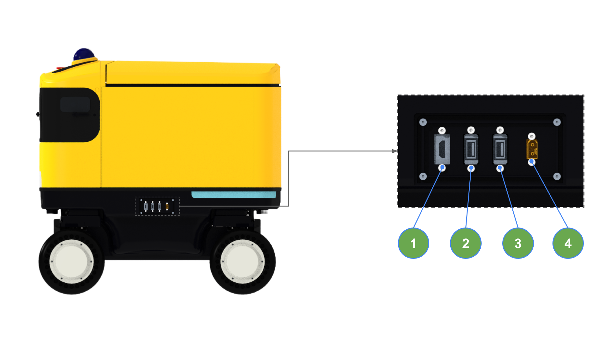

The HMI panel is located on the lower left side of AntBot.

---

## Port Configuration

| No. | Port | Purpose |
| :---: | :--- | :--- |
| 1 | HDMI | External monitor connection |
| 2 | USB 1 (Blue) | Keyboard / Mouse, etc. |
| 3 | USB 2 (White) | Internal debugging (Do not use) |
| 4 | Manual Charging Port | Manual charger connection |

:::tip
The HMI panel is not needed during normal operation. It is used for debugging or initial setup.
:::
