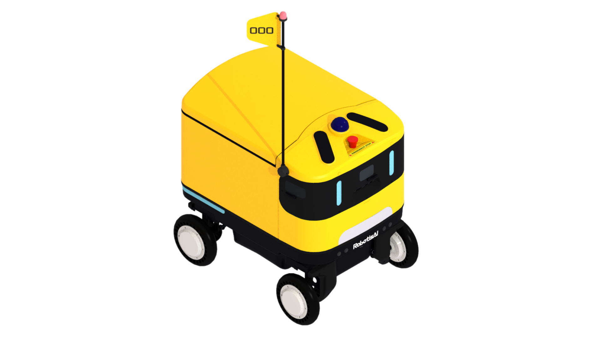
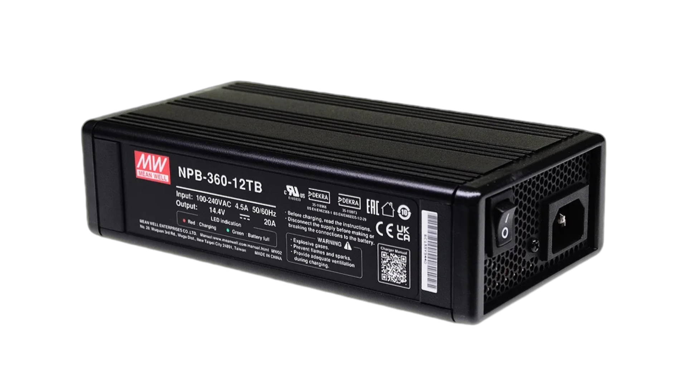
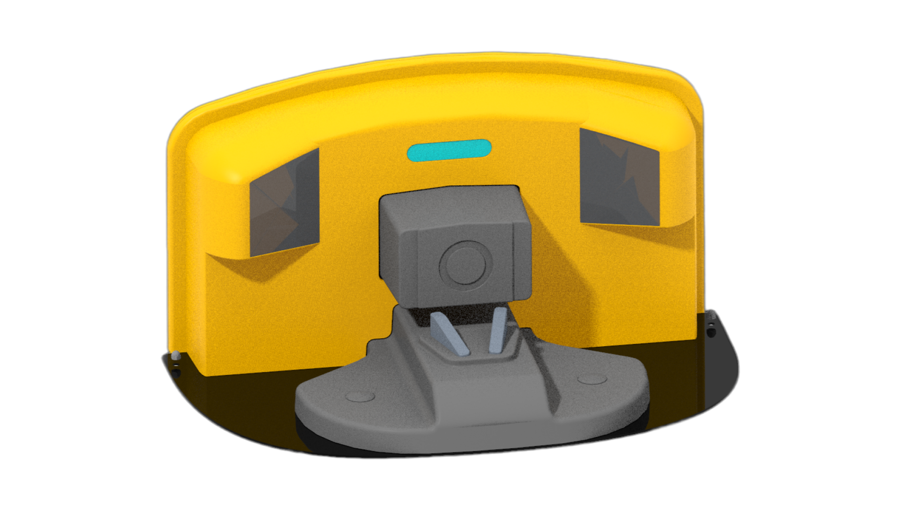

- **AntBot Main Unit** `x1`

  4WD Swerve Drive robot platform (with all sensors + onboard computer installed)

  

- **Manual Charger** `x1`

  Connect to the HMI panel charging port for charging

  

- **Wireless Charging Docking Station** `Optional`

  Sold separately, automatic docking and wireless charging

  
