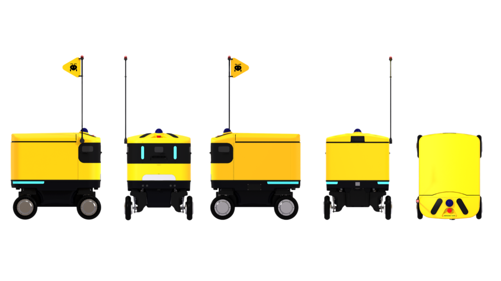

**AntBot** is an open-source **outdoor autonomous delivery robot** developed by ROBOTIS AI.
It uses a **Swerve Drive** system where each of the 4 wheels steers independently,
enabling omnidirectional movement and in-place rotation, optimized for last-mile delivery.

