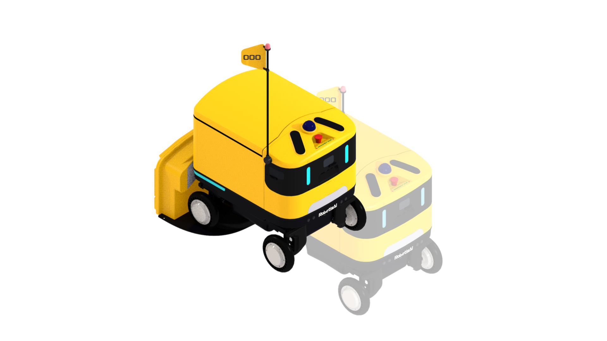

import { Steps } from '@astrojs/starlight/components';

You can charge the battery using the provided manual charger or the wireless charging station.

If the battery level drops below 5%, a buzzer will sound for 1 minute before the power turns off.

## Manual Charging

<Steps>

1. Locate the charging port on the [HMI panel](/antbot/en/hardware/hmi-panel/) on the left side of the robot and connect the charger as shown.

2. The charger LED shows **red** while charging and **green** when fully charged.

3. Once charging is complete (green LED), disconnect the charger.

</Steps>

---

## Wireless Charging Station

<Steps>

1. Charging starts automatically when the robot reverse-docks into the charging station.

</Steps>
