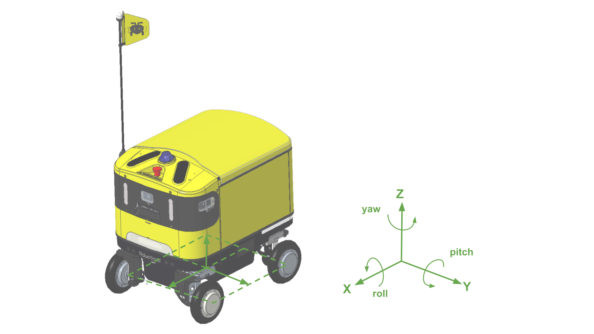

AntBot에 탑재된 주요 센서 목록과 `base_link` 기준 좌표입니다.

## 주요 센서 구성

| 센서 | 수량 | 연결 | 비고 |
| :--- | :---: | :--- | :--- |
| 3D LiDAR | 1 | Ethernet | |
| 2D LiDAR | 2 | USB | 전방 + 후방 장애물 감지 |
| RGB-D 카메라 | 1 | USB | Color + Depth |
| 모노 카메라 | 4 | V4L2 | 전방 3 + 후방 1 |
| IMU | 1 | USB | |
| GNSS | 1 | USB | GPS 수신기 |

---

## 센서 좌표
- 위치: `mm`
- 각도: `degree`

### 카메라

| 센서 | 위치 | X | Y | Z | Roll | Pitch | Yaw |
| :--- | :--- | ---: | ---: | ---: | ---: | ---: | ---: |
| 모노 카메라 | LEFT | 260.000 | 254.770 | 587.500 | 0 | 0 | 90 |
| 모노 카메라 | CENTER | 358.070 | 0 | 587.500 | 0 | 0 | 0 |
| 모노 카메라 | RIGHT | 260.000 | -254.770 | 587.500 | 0 | 0 | -90 |
| 모노 카메라 | BACK | -376.690 | 0 | 299.000 | 0 | 0 | 180 |
| RGB-D 카메라 | CENTER | 348.162 | 47.500 | 526.484 | 0 | 30 | 0 |

### LiDAR

| 센서 | 위치 | X | Y | Z | Roll | Pitch | Yaw |
| :--- | :--- | ---: | ---: | ---: | ---: | ---: | ---: |
| 2D LiDAR | FRONT | 325.000 | 0 | 255.000 | 0 | 180 | 0 |
| 2D LiDAR | BACK | -325.000 | 0 | 255.000 | 180 | 0 | 0 |
| 3D LiDAR | FRONT | 225.332 | 0 | 724.904 | 0 | 10 | 0 |

### 기타 센서

| 센서 | X | Y | Z | Roll | Pitch | Yaw |
| :--- | ---: | ---: | ---: | ---: | ---: | ---: |
| IMU | 240.000 | 6.75 | 390.200 | 0 | 0 | 180 |
| GNSS | 202.600 | -128.000 | 660.000 | 0 | 0 | 180 |

:::note
URDF에서 이 좌표를 확인하려면 [`antbot_description/urdf/antbot.xacro`](https://github.com/ROBOTIS-move/antbot/blob/main/antbot_description/urdf/antbot.xacro)를 참조하세요.
:::
